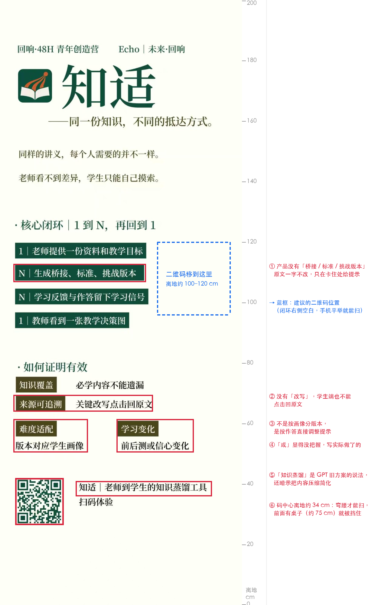
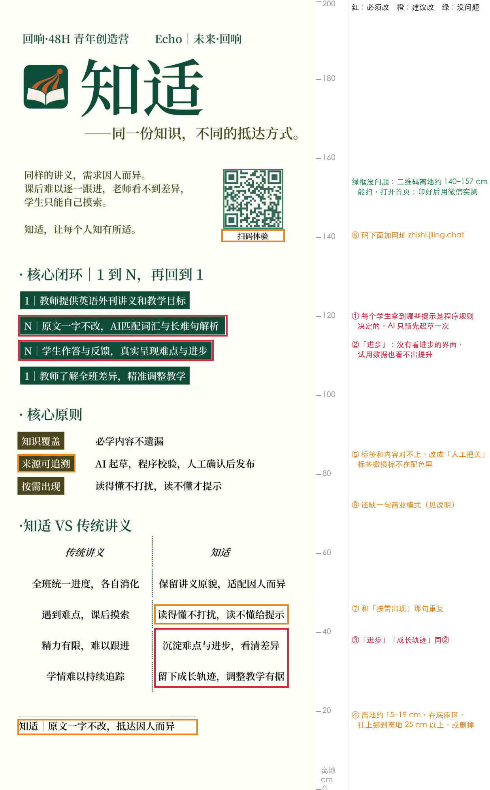

# 易拉宝修改意见（团队自制版）

> 对象：团队自己排的 80×200 cm 易拉宝（第一到第四版截图都是 800×2000 px，按 1 px = 1 mm、画面底边贴地换算）。
> 本文的产品说法都对照过代码和数据，尺寸用程序在截图上量过。**要改什么，看下面的「当前修改方案」**；改完按其中 E 节的清单自查，再发来核对。

## 当前修改方案（以这一节为准）

> **基于第四版海报**（10-02，**今晚交**）。网址已经改好。「读懂轨迹」**已上线**：开发会话 15:39 标注，15:47 我核对线上代码，确实已经有了。
> 本节是**整张版面的定稿文案**：每个说法只出现一次，从上往下照着替换。
> 老师、学生、讲义这几个核心名词避免不了，会出现多次；其余词组都只出现一次。
> 后面的第一到第三版核对和批注是推理过程；有冲突时，以本节为准。

> **第五版核对（10-02 晚）**
> - **已改好**：网址（zhishi.jiling.chat 正确）、闭环 3（读懂轨迹）、「关键设计」标题、结尾文字。
> - **还没改**：
>   - 问题陈述、闭环 1 和 4、人工把关、按需出现、对比标题、对比表四行，都还是第四版的文字。
>   - 结尾仍然离地约 15–19 cm。
>   - 标签仍是橄榄棕。
> - **不改不能印**：对比 3 右栏还有「进步」；结尾太低。
> - 其余几处是重复，见下表。

> **两处「不改不能印」已在 Canva 里改好（10-02 16:38，方案一）**
> - 对比 3 右栏改成「沉淀全班卡点，看清差异」。
> - 表格压不矮，所以删掉表头行「传统讲义 / 知适」，小标题改成「·传统讲义 VS 知适」（改完重新锁定）。
> - 量过的位置（从顶端算）：表格底边约 167.2 cm，分隔线 169.2 cm，结尾 170–172.95 cm，离地约 27 cm，满足 ≥25 cm。结尾和分隔线核对时已经在这个位置，没有再动。
> - 重复的说法按队长要求暂不改；下表 A 仍是去重后的建议。

### A. 定稿文案（全版，从上到下）

| 区块 | 第四版 | 定稿 |
|---|---|---|
| 赛事行 | 回响·48H 青年创造营　Echo｜未来·回响 | 不变 |
| 名称 | 知适 | 不变 |
| 副标题 | ——同一份知识，不同的抵达方式。 | 不变 |
| 问题陈述 | 同样的讲义，需求因人而异。课后难以逐一跟进，老师看不到差异，学生只能自己摸索。 | **讲义发给全班，难懂的句子却各有各的。 老师课后难以逐一跟进，学生只能自己摸索。** |
| 名称释义 | 知适，让每个人知有所适。 | 不变 |
| 二维码 | 扫码体验 / zhishi.jiling.chat | 不变（已改好） |
| 闭环标题 | · 核心闭环｜1 到 N，再回到 1 | 不变 |
| 闭环 1 | 1｜教师提供英语外刊讲义和教学目标 | **1｜老师提供英语外刊讲义和教学目标** |
| 闭环 2 | N｜原文一字不改，自动匹配词汇与长难句提示 | 不变 |
| 闭环 3 | N｜学生作答与反馈，真实呈现难点与进步 | **N｜学生作答与反馈，生成专属读懂轨迹** |
| 闭环 4 | 1｜教师了解全班差异，精准调整教学 | **1｜老师据此点评、调整教学** |
| 原则标题 | · 核心原则 | **· 关键设计** |
| 原则 1 | 知识覆盖｜必学内容不遗漏 | 不变 |
| 原则 2 | 人工把关｜AI 起草，程序校验，人工确认后发布 | **人工把关｜AI 起草，程序校验，审核后发布** |
| 原则 3 | 按需出现｜读得懂不打扰，读不懂才提示 | **按需出现｜看得懂不打扰，看不懂再帮忙** |
| 原则 4 | 商业模式｜学生免费，学校按生付费（规划） | 不变 |
| 对比标题 | ·知适 VS 传统讲义 | **· 对照一看** |
| 对比表头 | 传统讲义 / 知适 | 不变 |
| 对比 1 | 全班统一进度，各自消化 / 保留讲义原貌，适配因人而异 | **生词表全班一张 / 生词量身挑选** |
| 对比 2 | 遇到难点，课后摸索 / 理解处留白，疑惑处点拨 | **有疑问，等次日讲评 / 当场一步步拆开读** |
| 对比 3 | 精力有限，难以跟进 / 沉淀难点与进步，看清差异 | **抽查全凭随机 / 谁卡在哪句，一目了然** |
| 对比 4 | 学情难以持续追踪 / 调整教学有据 | **往届的坑，新生照样踩 / 标出该先搭梯子的位置** |
| 结尾 | 知适｜原文一字不改，抵达因人而异（离地约 15 cm） | **知适｜把讲义里的「如果」，改成「你」**（往上挪，见 B2） 备选：**知适｜外刊精读，从你需要的地方开始** |

**为什么这样改**：

- **问题陈述**：
  - 去掉「因人而异」「差异」，不再用「同……不同……」句式，免得和副标题撞。
  - 第一行缩到 17 字（约 40 cm），原来那版会顶到二维码。
  - 第二行约 48 cm，离二维码只剩约 2 cm；嫌挤就拆成两行。
- **闭环**：
  - 3：用「专属」，不用「每个人」，免得和名称释义重复。
  - 4：「谁卡在哪」交给对比表去讲。
- **关键设计**：
  - 标题：和「核心闭环」都用「核心」，所以换掉；「商业模式」放在「设计」下面也合适。
  - 原则 2：一行里出现两次「人工」，改成「审核」，对演示讲义（队友校对）和老师上传的文章（老师预览后发布）都成立。
  - 原则 3：避开问题陈述里的「读不懂」和闭环 2 的「提示」。
- **对照一看**：
  - 标题：原标题和表头是同样两个词，所以换掉。
  - 四行各讲一件新事：生词、读句子、老师看学情、下一届。
  - 对比 1：对应「学生词」只练自己的词。
  - 对比 2：对应读懂梯子的三步。
  - 对比 3：讲义原来的做法就是「老师随机抽取点评」。
  - 对比 4：「坑」配「梯子」，一个比喻讲到底。「下一届的起点」做到的是标出句子 + 预览，所以用「标出」，不说「下一届不用再卡」。
- **结尾**：
  - 用团队最早的那句钩子（README 标题，展位话术也在用），全版其他地方都没出现过。
  - 对应演示讲义里的「给你」便签：老师写「如果不认识 fret 一词」，产品把它变成给你的提示。
  - 如果讲解员不打算讲 fret 这个例子，就用备选那句。

### B. 版面

| # | 改什么 | 怎么改 |
|---|---|---|
| B1 | 结尾不删，往上挪 | 底边离地 ≥ 25 cm（在 80×200 画布上离顶 ≤ 175 cm）。 收紧对比表的间距：行距从约 7.8 cm 收到约 6.4 cm，表头上下各收 1–1.5 cm，能省约 7 cm。结尾放在表下面约 2–3 cm 处，正好落在离地 25–29 cm。 再往下是底座附近，空着是正常的 |
| B2 | 标签颜色 | 四个标签的橄榄棕改成深绿 **#0F4C3A** 或琥珀 **#A3570C** |
| B3 | 二维码实测 | 印 A4 小样，再按 1:1 在 A3 上打一张二维码区域，用微信、iPhone 相机、安卓相机各扫一次；码点是深绿，扫不顺就改黑色 |

**排得下吗**：
- 对比表每格最多 10 个字（约 25 cm），都在栏宽以内。
- 闭环 3 和第四版一样长，其余各行都不比第四版长。
- 结尾 17 字，约 47 cm。

### C. 最终核对清单

- [ ] 文案和 A 节定稿一字不差，全版统一叫「老师」
- [ ] 全版没有「进步」「成长轨迹」「AI 匹配」「因人而异」（副标题的「不同的抵达方式」除外）
- [ ] 网址是 zhishi.jiling.chat，二维码扫开是首页；印好的小样用微信、iPhone 相机、安卓相机都扫过
- [ ] 标签颜色是深绿或琥珀
- [ ] 顶部、左右 4 cm 内没有内容；结尾底边离地 ≥ 25 cm（画布上离顶 ≤ 175 cm）
- [ ] 交图文店的是「PDF 打印」导出的文件；80×200 还是 80×205，已和店里确认

---

## 第一版核对（v1，历史记录）

红框是要改的地方，蓝框是建议的二维码位置，右侧刻度是离地高度（cm）。

### 总体评价

**做得好的地方**
- 风格统一、干净：深绿主色、logo 和衬线大标题很协调。
- 「1 到 N，再回到 1」扣住了赛道的「回响」主题。
- 开头两句问题陈述很准：「同样的讲义，每个人需要的并不一样。老师看不到差异，学生只能自己摸索。」
- 二维码能扫，解码后打开的是网站首页 https://zhishi.jiling.chat/ 。
- 字够大：正文和色块里的字高约 2.5–2.8 cm，3–5 米外都看得清。

**主要问题**：几处说法描述的是产品没有的功能，评委扫码一试就对不上；二维码放得太低，站着几乎扫不到。

### 一、必须改

#### 1. 和实际产品对不上的说法

这几句来自之前那份 GPT 方案「知适：老师到学生的知识蒸馏工具」。那份方案在盲评中（5 位匿名的模拟评委按官方四项打分，v2 29 分，GPT 方案 18.5 分）输给了现在方案的前身 v2。其中「桥接版」正是被否掉的点：它本质上是简化改写，会删掉老师要教的 pending 和倒装。我们做出来的产品恰恰相反：**原文一字不改，只在学生卡住的地方给提示**。

| 位置 | 现在写的 | 建议改成 | 原因 |
|---|---|---|---|
| 核心闭环第 2 条 | N｜生成桥接、标准、挑战版本 | **N｜原文一字不改，每人的提示不同** | 产品不分版本 |
| 核心闭环第 4 条 | 1｜教师看到一张教学决策图 | **1｜老师看到全班卡点：今天该点评谁** | 原句没错，但太抽象。写成老师端首屏的具体内容：「今天点评这几个人」和卡点热力图 |
| 如何证明有效 | 来源可追溯｜关键改写点击回原文 | **人工把关｜AI 起草，程序校验，人工确认后发布** | 见表下说明 1 |
| 如何证明有效 | 难度适配｜版本对应学生画像 | **按需出现｜读懂就收起，卡住才给梯子** | 见表下说明 2 |
| 二维码旁 | 知适｜老师到学生的知识蒸馏工具 | **知适｜英语外刊精读，原文一字不改** | 「蒸馏」是机器学习术语，还暗示把内容压缩、简化，和我们的卖点正好相反 |

**说明 1：为什么不能写「关键改写点击回原文」，也不写「每条都附讲义原话」**

- **原文不改，也没有回链**：产品不改写原文。梯子第 2、3 步的「正常语序」「简单英文」只是提示，原句一直留在上面（10-02 后第 2、3 步改成「拆开」「译文」，同样只是提示）。界面上没有「点一处改写、跳回讲义出处」的功能，出处只记在讲义数据里，网页上不显示。
- **附讲义原话的只是一部分**：演示讲义里，29 个句子都标着出自讲义哪一处；老师的 15 个核心词和 3 个写作要求表达附着讲义原话；其余词和表达，以及梯子、题目，都是 AI 起草的。
- **人工把关两种讲义不一样**：
  - 演示讲义：121 条由队友 2 逐条校对（借助 ChatGPT 复核），分歧逐条裁定后由队长确认；之后题目改成英文，又经独立复核和队长确认。两次合计 231 条人工修订。
  - 老师自己上传的文章：没有人工校对，只有程序校验和老师预览后点「发布」；10-03 起老师能在上传页改 AI 起草的原句题、梯子和段意题，改完程序再校验。
- **所以**：对两种讲义都成立的说法是「AI 起草，程序校验，人工确认后发布」。如果一定要保留「来源可追溯」这个标签，就写「演示讲义：每句都标明出自讲义哪一处」，并明确只说演示讲义。

**说明 2：「读懂就收起，卡住才给梯子」具体指什么**

产品不是按画像分版本，而是按每个学生的实际作答调整：
- **收起**：带原句题的句子，第一次就答对、也没开梯子，老师讲解就自动收起，可以再展开。打卡句永远不收起。老师上传的文章，老师写了讲解的句子才有这一步，没写讲解的句子没有。
- **出梯子**：点「我卡住了」，或在「先自己试」、评委模式里答错原句题，才出梯子第 1 步。

**排版注意**：「读懂就收起，卡住才给梯子」有 12 个字，约 34 cm 长。放在现在的左栏，会一直顶到右栏「学习变化」（右栏从离左边约 39 cm 开始）。建议「如何证明有效」四条都改成和「知识覆盖」「来源可追溯」一样的一行式：标签在左，文字从离左边约 25 cm 开始，整块高度基本不变。「AI 起草，程序校验，人工确认后发布」约 16 个字、45 cm 长，一行式能放到约 70 cm，在右边距以内。

**「原文一字不改」是我们和 Diffit、Level Read 这类分档改写工具最大的区别**，现在整张海报一次都没出现。按上表改完，闭环和底部各出现一次。

#### 2. 二维码太低

- **现在**：码在离顶 159–173 cm 处，码中心离地约 **34 cm**，大约在膝盖高度。评委要弯腰才能扫，前面如果有展桌（约 75 cm 高），码会被整个挡住。
- **建议**：移到「核心闭环」右侧的空白处（标注图蓝框），离顶约 80–104 cm，**码中心离地约 100–120 cm**，站着把手机平举在胸前就能扫。
- **尺寸**：码边长约 20 cm（现在约 14 cm）。按上表改完，第 2、4 条色块会伸到离左边约 53–54 cm，右边还剩约 22 cm，正好放得下 20 cm 的码，码大致放在离左边 55–75 cm。
- **码下面写两行**：「扫码体验」和网址 **zhishi.jiling.chat**，扫不了的人可以手动输入。
- **用哪个码**：仓库里的 `docs/assets/qr/home.svg`，矢量格式，指向首页，自带白边。保持黑码白底，不要改颜色，也不要在码上盖 logo。

### 二、建议改

- **「学习变化｜前后测或信心变化」**：「或」字显得我们自己没把握，而且三步小测目前还没有结果（`docs/三步小测.md` 的记录表是空的）。
  - **现在**：先删掉这一条，或把标签换成「效果验证」，写「三步小测进行中」。
  - **有数据后**：照实写，例如「三步小测：n 位朋友试用，用过梯子后读同结构新句平均 x/3 分（小样本，非对照）」，结果不好也照实写。写的时候用一行式，文字不要超过约 18 个字（从离左边 25 cm 排到 76 cm 以内）。
  - 没测过的结果不要上板，评委会追问。
- **加一句商业模式**：评分标准里商业价值占 25%，现在整张一处都没有。建议加「**学生免费 · 学校按生付费（规划）**」，放在二维码挪走后的底部，或闭环下方。不印价格和市场规模，这些由讲解员口头说，并说明是假设。
- **标签颜色**：「知识覆盖」等标签用的橄榄棕（#48421E）不在我们的配色里。改成主色深绿 #0F4C3A，或产品里代表「卡点」的琥珀 #A3570C。

### 三、可选

- **加一个具体例子**：现在整张都是抽象的话。评委要在几秒内看懂，最好有个画面。可以用已经生成的插画 `docs/assets/poster/核心插画-gpt原图.webp`（讲义上一处被圈出来，箭头指向一张便签）。要注意三件事：
  - **图上没有字**：椭圆和便签都是空的。「如果不认识 fret 一词」「你卡在 fret？」「先猜一猜」等字要在 Canva 里补上，位置照 `docs/海报提示词.md` 的「Canva 补在插画上的字」。那里的字号是按插画印 66 cm 宽量的，缩小后按「实际宽度 ÷ 66」等比缩小。
  - **要先腾出空间**：两句问题陈述下面现在只有约 12 cm 高。直接塞进去，图只有约 18 cm 宽，字不到 1 cm，所以要先把下面各块往下挪。
  - **底色不一样**：插画是 #F2F3EE，海报是 #FEFFF7。给插画加一个圆角白框，或者把海报底色改成插画的颜色，免得看出接缝。
- **字号**：现在的字号已经够用。**闭环四条不要放大**：按上表改完，右边只剩约 22 cm，刚好放 20 cm 的码；再放大一档，右边只剩 15–18 cm，码就放不下了。

### 附：现版各块离地高度（按 80×200 cm 换算，画面底边贴地）

| 区块 | 离地 | 判断 |
|---|---|---|
| 赛事名「回响·48H 青年创造营」 | 约 184 cm | 好 |
| logo + 「知适」 | 约 164–179 cm | 好，在视线高度 |
| 副标题、两句问题陈述 | 141–160 cm | 好 |
| 核心闭环四条 | 92–120 cm | 好，胸口高度 |
| 如何证明有效 | 51–78 cm | 偏低，前面有桌子会被挡 |
| 二维码 | 27–41 cm（中心约 34） | **太低，要上移** |
| 底部空白 | 0–27 cm | 可以，靠近底座本来就不放内容 |

**摆放**：易拉宝立在展桌侧前方，前面留空，不要放在桌子后面。

---

## 第二版核对（v2，历史记录 + 批注）

红框必须改，橙框建议改，绿框没问题。

### 第一版的问题，改掉了哪些

| 第一版的问题 | 第二版 |
|---|---|
| 「桥接 / 标准 / 挑战版本」「点击回原文」「版本对应画像」「知识蒸馏」 | 都已去掉 |
| 「原文一字不改」没出现 | 闭环第 2 条和底部各出现一次 |
| 二维码离地约 34 cm | 移到问题陈述右边，离地约 140–157 cm（中心约 148），边长约 14 cm。能扫，打开首页 |
| 「学习变化｜前后测或信心变化」 | 已删 |
| 证明有效那几条排不下 | 改成一行式，都在右边距以内 |
| 缺网址 | **还缺** |
| 缺商业模式 | **还缺** |
| 标签橄榄棕 | **没改**（仍是 #4A461E） |

### 必须改

| 位置 | 现在写的 | 建议改成 | 原因 |
|---|---|---|---|
| 核心闭环第 2 条 | N｜原文一字不改，AI匹配词汇与长难句解析 | **N｜原文一字不改，按卡点给词汇与长难句提示** | 每个学生拿到哪些提示，是程序按他的作答规则决定的（`src/engine/` 是纯函数）。AI 只在老师那一侧预先起草一次，学生使用时不调用 AI（写作检查除外）。另外「解析」容易让人以为是讲语法，梯子讲的是意思 |
| 核心闭环第 3 条 | N｜学生作答与反馈，真实呈现难点与进步 | **N｜学生作答与反馈，记录每个人的卡点** | 产品里没有看「进步」的界面。朋友试用（n=8）的三步小测也看不出提升，团队已定路演不说提高 |
| 传统讲义 vs 知适，第 3 行右 | 沉淀难点与进步，看清差异 | **沉淀全班卡点，看清差异** | 同上 |
| 传统讲义 vs 知适，第 4 行右 | 留下成长轨迹，调整教学有据 | **留下作答记录，调整教学有据** | 产品记录每次作答（老师端据此重建），但没有「成长轨迹」视图 |

**团队定的新措辞（10-02，和开发会话商量后）**：「进步」改叫「**读懂轨迹**」，由开发会话补做这个功能。

| 原文 | 改成 |
|---|---|
| 学生作答与反馈，真实呈现难点与进步 | 学生作答与反馈，真实呈现卡点与读懂轨迹 |
| 沉淀难点与进步，看清差异 | 沉淀卡点，看清每个人的差异 |
| 留下成长轨迹，调整教学有据 | 留下读懂轨迹，调整教学有据 |

**条件**：送印前「读懂轨迹」必须已经在线上能看到，否则海报写的就是还没做的功能。
- 核对时（10-02），代码里还没有这个功能。
- 两句都暗示老师能看到它（「调整教学有据」），所以至少要在老师端能看到每个学生、每一句是怎么读懂的，例如「卡住 → 开到梯子第几步 → 读懂」，或「第一次就读懂」。
- 功能冻结（10-03 14:00）前没做完的话，退回「记录每个人的卡点」「留下作答记录」这两种说法。
- 排版上放得下：闭环第 3 条多 2 个字，约伸到离左边 59 cm；对比表两句和原来差不多长。

> **开发会话批注（10-02 15:14）**：「读懂轨迹」今天开工，代码审查一结束就做，预计 10-02 晚上上线，上线后在这里补一行「已上线 + 时间」。**下单前以这一行为准**，没有这一行就退回「记录每个人的卡点」「留下作答记录」。
>
> **✅ 已上线：10-02 15:39**。线上老师端 https://zhishi.jiling.chat/#/teacher 往下翻，热力图下面就是「读懂轨迹」，点同学名字能看个人轨迹。审查后修了 12 条，「先自己试」按作答时间顺序算。**闭环第 3 条、对比表两句可以用「读懂轨迹」的新说法定稿。** 讲解员被问「这是不是进步」时回答：轨迹只记每句是怎么过的，后面的句子要先答题、三选一也能蒙对，也可能本来就更容易，不说明读懂能力有变化。
> 计划在老师端看到的内容（对照上面「至少要能看到」那条）：
> - **全班**：同一类长难句按出现顺序排开，每句写「自己读懂 x / y 人」。演示讲义里有三条：同位语从句 2 句、倒装 3 句、指代 4 句。另加一行：被要求先自己试的句子，第一次答对了几次。
> - **每个学生**：在「读懂轨迹」里点任何一位同学（或点评名单、抽屉里的名字），看到他每一句是怎么过的：自己读懂（没开梯子、第一次就答对）/ 梯子到第几步 · 第几次答对 / 没开梯子 · 第几次答对 / 答了几次还没答对 / 还没做。标出哪几句是「先自己试」（按作答的时间顺序算）。
> - **措辞**：页面上叫「读懂轨迹」，不叫「进步」。同一篇文章里后面的句子可能本来就更容易，轨迹只说明发生了什么，不说明能力提高了。讲解员被问「这是不是进步」时，照这句回答。

### 建议改

- **底部那句太低**：「知适｜原文一字不改，抵达因人而异」离地只有约 15–19 cm，在底座附近，站着的人看不到，有的底座还会挡住。可以往上挪到离地 25 cm 以上，或者删掉，「原文一字不改」在闭环里已经有了。
- **对比表第 2 行和上面重复**：「读得懂不打扰，读不懂给提示」和核心原则「按需出现｜读得懂不打扰，读不懂才提示」几乎一样。建议删掉对比表这一行，正好给下面两条腾出空间。
- **「来源可追溯」标签和内容对不上**：后面写的是「AI 起草，程序校验，人工确认后发布」，标签改成「**人工把关**」。标签颜色顺便改成深绿 #0F4C3A 或琥珀 #A3570C。
- **码下面加网址**：在「扫码体验」下面加一行 **zhishi.jiling.chat**。
- **加一句商业模式**：评分标准里商业价值占 25%，现在仍然没有。最顺的位置是核心原则的第 4 行，和前三行一样排成一行式：「**商业模式｜学生免费 · 学校按生付费（规划）**」。多出来约 6 cm 高，删掉对比表重复的那一行（约 8 cm）就够了；这样底部那句也能往上挪到离地 25 cm 以上。
- **二维码颜色**：码点是浅一点的绿（约 #396652），截图能扫。但印出来对比度会变低，印好小样后用微信和手机相机各扫一次；扫不顺就改回黑色，或主色深绿 #0F4C3A。

### 可选

- ~~**「下一届的起点」可以写了**：老师端已经有这一块……对比表最后一行可以写成「全班卡点，变成下一届的起点」~~（这条说满了，以下方开发会话批注为准。）

> **开发会话批注（10-02 15:14）**：上面「老师端已经有这一块」要更正两点。
> 1. **还没上线**：代码已经在仓库里（74ca0ea），正在做代码审查，审查后今天上线。上线后我在这里补一行「已上线 + 时间」。
>    - **已上线：10-02 15:20**（审查后修了 22 条问题再上线），线上老师端 https://zhishi.jiling.chat/#/teacher 往下翻就能看到。仍然只是「建议名单 + 预览」，第 2 点照旧。
> 2. **现在做到的是「建议名单 + 预览」**：
>    - 做到了：老师端按全班卡点列出下一版该先搭梯子的句子（卡在「中」以上至少 2 人、且不少于三成），点「预览」能看到学生那边的样子。
>    - 还不能：真的把这一版发给下一届学生。下一届打开的仍是原讲义。
>    - 所以「全班卡点，变成下一届的起点」偏满。建议改成「**全班卡点，标出下一版先搭梯子的句子**」（长度差不多）；要用原句，讲解员必须补一句「发给下一届是下一步」。
>    - `docs/提交信息.md` 和 `docs/展位话术.md` 第 12 问，等上线后由开发会话同步改。

> **回复（10-02）**：同意更正，前面那条我说满了，已经划掉。补一个排版上的问题：
> - 「全班卡点，标出下一版先搭梯子的句子」有 17 个字，约 42 cm。对比表右栏从分隔虚线（离左边约 38.5 cm）到右边距（76 cm）只有约 37 cm，放不下。
> - 要用的话，写 12 个字的「**标出下一版先搭梯子的句子**」（约 30 cm，和现在那几行差不多长），替换对比表里的某一行，左栏也要配一句对应的。
> - 必须等「已上线」那一行补上后才能用。
