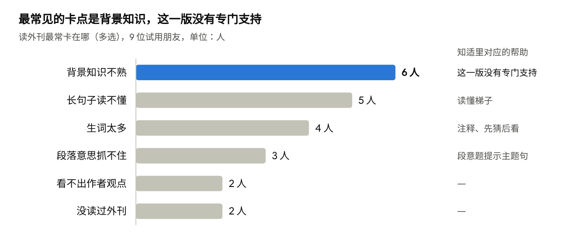
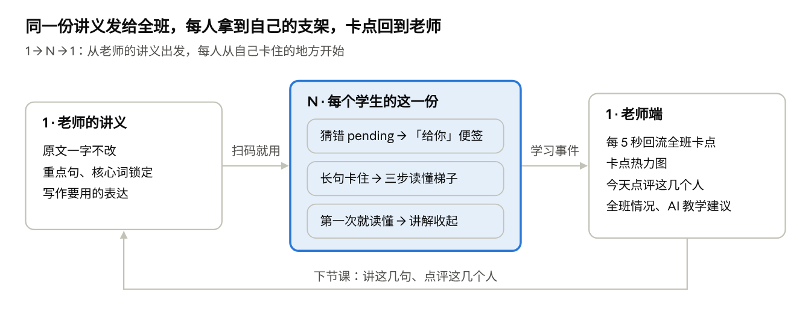
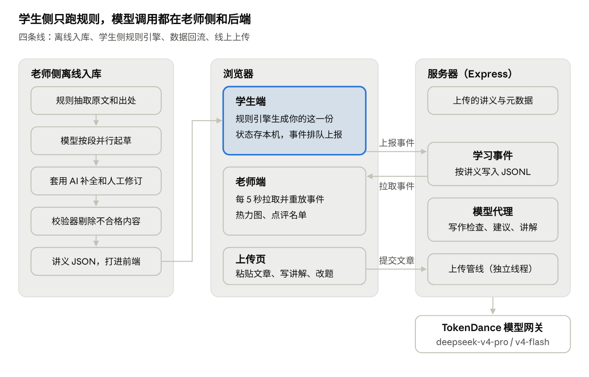
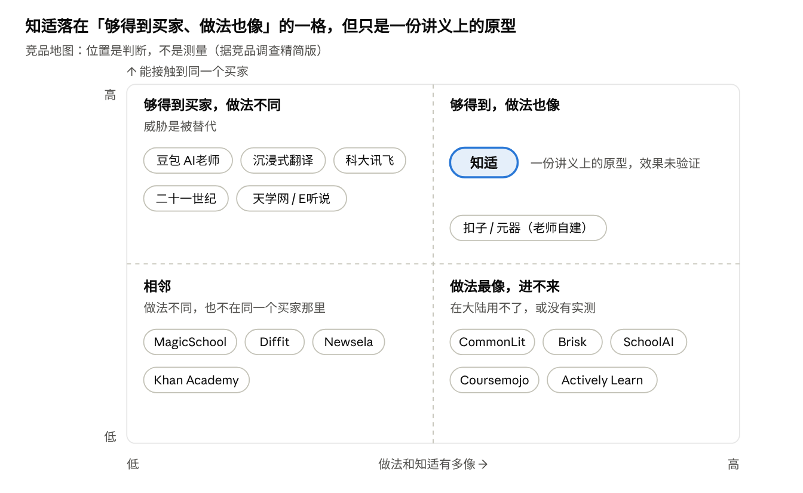

# 知适 产品报告

2026-10-03

## 摘要

知适是一款面向高中英语外刊精读的个性化讲义工具：老师的讲义原文一字不改，只在每个学生卡住的地方给帮助，再把全班的卡点交回老师。它是 3 名高中生在杭州学军中学「回响 · 48H 青年创造营」Echo 赛道 48 小时内做出的作品，已在 https://zhishi.jiling.chat 上线。

- **问题**：一份外刊讲义发给全班，老师只能写「如果不认识 fret 一词……」，也只能随机抽查，看不见谁卡在哪一句。
- **做法**：学生卡住时开三步「读懂梯子」；第一次就读懂的句子收起老师讲解；老师写给全班的「如果」变成只给不认识那个词的人看的「给你」便签。老师端每 5 秒更新卡点热力图和「今天点评这几个人」；老师粘贴一篇英文文章就能生成讲义，4 段短文实测 12 到 18 秒。
- **理念**：知适只信直接证据。学生一侧的适配全部是确定性规则，只有写作检查调用 AI；其余 AI 都在老师一侧起草，输出都经过程序校验。
- **质量**：演示讲义里模型起草的 121 条内容经人工逐条校对，校验 0 错误；另有 126 条 AI 补全内容、5 张假词卡和句子的结构标签还没有人工校对。
- **工程**：284 个自动化测试全部通过，产品代码约 8,900 行。开赛 70 分钟后有第一个代码提交，第二天凌晨全链路已上服务器。
- **证据**：9 位朋友自愿远程填的匿名问卷里（后台有学习记录的 4 人，不是随机抽样），6 人读不懂时会把句子交给翻译软件或 AI；三步小测看不出提升，团队也没有这样宣称。
- **市场**：第一客户是学校英语组，首批先服务国际化学校，学校按学生、按年付费，学生和老师免费。价格是假设，付费证据和试点都是 0。查到的 70 个产品里（12 个逐项核实，其余多为初步判断），没有一个同时做到知适的六件事，但这是窗口期，不是护城河。
- **主要风险**：效果还没验证；学习数据接口没有鉴权；演示讲义不得商用。下一步是找一个班完整试用一期。

## 1. 背景与问题

知适回答的是 Echo 赛道的题目「你希望教育如何对待下一个像你一样的人？」。团队的回答是：同一份外刊讲义，不该对全班只写一个「如果」。

### 1.1 赛事背景

- **赛事**：杭州学军中学「回响 · 48H 青年创造营」，赛期 10-01 至 10-04，核心开发从北京时间 10-01 22:00 到 10-03 24:00。
- **赛道**：赛道一「Echo｜未来·回响」（教育），要求把受过的教育通过科技传递下去，变成下一个人的起点。
- **评审**：初赛四项各占 25%，即主题完成度、商业价值与市场需求、创新性、技术运用与实现质量。10-04 上午展位巡场，下午获奖队路演。
- **团队**：3 名高中生。队长（本报告指负责技术的队员；平台上登记的队长是另一位）负责开发和部署，另两人负责产品设计、主讲、教研校对和演示。团队选 Echo 而不是 AI 评估得分最高的企业赛题，是因为擅长路演和写作，对教育有自己的看法。

### 1.2 要解决的问题

**一份 PDF 只能写「如果」。** 演示讲义 Day 2 里老师写道：「第一句话中如果不认识 fret 一词，很大概率可能会不理解本句话的意思。」Day 3 对 pending 也有同样的「如果」。讲义发给全班，这句话没法落到具体的人身上。

**老师看不见谁卡在哪。** 讲义 Day 2 到 Day 5 每天开头都写着「老师会随机抽取点评」。老师只能抽查，不知道哪个学生卡在哪一句、卡在词还是句子结构。

**简化原文不是答案。** 团队最初设想过用 AI 把难的内容自动简化。压力测试指出，讲义精讲的长难句和 15 个核心词正是老师这周要教的，简化等于删掉教学目标。

**学生的现有做法会绕过老师的讲义。** 9 位朋友自愿远程填了问卷（后台有学习记录的 4 人，不是随机抽样），其中 6 位读不懂时会把句子交给翻译软件或 AI。团队实测豆包、Kimi、DeepSeek：说「帮我简化一下」，三家都改写了原文，DeepSeek 还给出整段中文；换成写得很细的提示词，三家都做到了不改写、只给提示，但都用了语法术语。

### 1.3 机会

真正稀缺的不是讲义，而是老师对每个学生的注意力。小班尚且只能抽查，普通高中一个班四五十人，缺口更大。知适想把全班每个人的卡点收集起来交给老师，同时让每个学生拿到写给自己的那一份讲义。

## 2. 目标用户与用户调研

知适的使用者是读外刊讲义的高中生和布置外刊的高中英语老师，付费方定为学校英语组。目前的需求证据只有 9 位朋友的匿名问卷，不是随机抽样，也不是对照实验。

### 2.1 用户画像

| 角色 | 是谁 | 在知适里做什么 |
| --- | --- | --- |
| 学生 | 用外刊讲义学英语的高中生，课后独自读外刊、做打卡作业 | 扫码就用，不登录、不注册、不填名字；走完粗读、词汇、精读、写作 |
| 老师 | 布置外刊、想看全班卡在哪的高中英语老师 | 看老师端；粘贴文章生成讲义；写或确认讲解 |
| 第一客户 | 学校英语组（10-02 15:53 定），首批是国际化学校（10-03 定） | 按学生、按年付费（规划，单价是假设） |
| 第二候选客户 | 外刊精读营、打卡营 | 赛后验证 |

用户设定变过一次。最初只针对国际高中学生，后来放宽到一般高中生，并把老师加进来。首批客户定为国际化学校的英语组（10-03 队长定），展位话术和市场测算也是这个口径；但试用样本里还没有国际学校学生，要赛后补。

### 2.2 调研方法

原计划是营地问卷不少于 30 份、请老师试用 10 分钟、请 5 到 10 位同学做小测。现场找不到人，10-02 中午改成发给朋友远程做。

- **问卷**：飞书匿名表单，13 题分 5 部分，约 15 分钟，不收集姓名和账号。要求中间一段使用知适学生端。
- **三步小测**：先不查词典冷读讲义里的 S17，再用知适读这篇，最后读一句结构相同、内容不同的新句。每句 0 到 3 分，按让步、pending、主干三个要点给分。
- **打分**：Claude 先打分，另一个 agent 不看已有分数独立盲评，前 8 份的 16 个分数完全一致。队友的人工抽查还没完成。
- **通用 AI 对照**：用豆包、Kimi、DeepSeek 网页版各问两次同一段讲义。一次是普通学生的问法，一次是写得很细的提示词。

### 2.3 问卷结果

快照时间是 10-02 17:06，共 9 份。这 9 份都是在当天下午的旧版产品上收的，当时梯子还没改成现在的「拆开 / 译文」。

| 问题 | 结果（n=9） | 口径 |
| --- | --- | --- |
| 样本构成 | 普通高中 5 人，其他 4 人；国际学校和公办国际部 0 人 | 在读高一至高三的 5 人 |
| 读不懂时怎么办 | 6 人会交给翻译软件或 AI | 多选：问 AI 6，整句翻译 5，查词典 5，跳过 1，问同学或老师 0 |
| 哪一步最有用 | 粗读点生词 4，先猜后看 3，读懂梯子 1，「给你」便签 1 | 单选 |
| 哪一步最麻烦 | 精读 4，写作 3，词汇 1，都还好 1 | 写作在问卷里是可选的 |
| 英文题难不难 | 觉得难 6（太难 1，有点难 5），刚好 3 | 单选 |
| 老师布置的话愿不愿意用 | 平均 3.22 分，中位数 3 分 | 1 到 5 分；问卷没有价格题 |
| 三步小测 | 冷读平均 0.67 分，用后读新句平均 0.89 分 | 满分 3 分；7 人前后同分，团队结论是「看不出提升」 |

长句和生词是知适重点做的两类卡点，分别由读懂梯子和注释、先猜后看覆盖；排第一的背景知识是问卷暴露出来的缺口。

### 2.4 后台记录里的行为

一位朋友 15 分钟的学习记录最能说明问题。他在粗读里点了 38 个不认识的词；「先猜后看」16 道猜错 12 道，其中 11 个随后又点了「认识」。

精读 20 道原句题他第一次答错 12 道，其中 10 道在 0.4 到 1.5 秒内换选项答对，最后 20 道对了 18 道。只看自评和最后的对勾，老师会以为他基本都会了。这条记录成了讲「知适只信直接证据」最直接的例子；这条原则在 10-01 晚的 v3 方案里就已提出。

问卷和后台也有对不上的地方：填问卷的有 9 人，后台有学习记录的设备只有 4 台；4 人自报在 S17 上开了梯子，后台却没有记录。原因还没查清。

### 2.5 根据试用做的改动（10-02）

1. 13:30 词汇卡第一次猜错的词，之后点「认识」也按不认识算。
2. 14:14 原句题第一次答错，自动打开梯子第 1 步。之后仍可换选项，但第一次答错已经记下。
3. 14:25 修复旧版 iOS Safari 整页白屏。
4. 14:57 加上页面访问和报错事件，并写了只读的试用漏斗脚本。
5. 18:01 梯子第 2、3 步改成「拆开」和「译文」，部分依据是问卷里冷读 0 分的人多。

### 2.6 证据的局限

- 样本小、非随机、远程填写，查没查词典无法确认；问卷匿名，和后台记录对不上号。
- 没有老师试用过。确认过的学校、付费意愿证据、约好的试点都是 0。
- 「老师会随机抽取点评」出自购买的外刊营格式讲义，不是学校老师的原话。
- 最常见的卡点「背景知识」（9 人中 6 人），这一版产品没有专门做。

## 3. 产品定位与价值主张

知适让每个学生读到写给自己的那一份讲义：原文一字不改，老师的必练项一个不少，只在学生卡住的地方加帮助，再把全班的卡点交回老师。个性化的不是文章，而是老师讲义里的那句「如果」。

### 3.1 一句话定位与对外说法

- **一句话介绍**：同一份外刊讲义，原文一字不改，每个学生读到写给自己的那一份。
- **主标语**：把讲义里的「如果」，改成「你」。这句最早出现在赛前方案 v2，「如果」来自讲义里老师对 fret 和 pending 的两句讲解。
- **名称释义**：知适，让每个人知有所适。易拉宝副标题是「同一份知识，不同的抵达方式」。
- **视频里的定义**：知适是一个按每个学生卡住的地方，提供不同的梯子和提示，帮学生自己读懂外刊的工具；全班卡在哪，也回响给老师。
- **核心理念**：知适只信直接证据。自评和作答对不上时，信作答。看过演示视频的几位路人里，有一位说最喜欢这一句。

### 3.2 价值主张

| 对谁 | 得到什么 |
| --- | --- |
| 学生 | 原文不变，卡住的地方才给注释和三步「读懂梯子」；第一次就读懂的句子，老师讲解自动收起；不认识的词有注释和「给你」便签；读到的表达要用进自己的写作，AI 判断用得对不对，但不替学生改写 |
| 老师 | 讲义原文和教学目标不变；全班卡点热力图和「今天点评这几个人」（定向 2 人加随机 2 人）；每 5 秒刷新的「刚刚」；「全班情况」和按需的 AI 教学建议；粘贴任意英文文章就能生成讲义 |
| 学校英语组 | 全班卡点回流给老师，是商业画布认为学校愿意付费的主要理由；还没有老师亲口认可过 |

### 3.3 产品原则

1. **原文一字不改，只适配支架。** 支架包括注释、读懂梯子、讲解收起还是展开、练习。难的句子正是老师这周要教的，简化就删掉了教学目标。
2. **老师的必练项一个不少。** 重点句的讲解不会因为答对就收起；15 个核心词一定在词汇卡里，永远不会被标成「可跳过」；写作要求的表达一定出现在写作里。
3. **题目全班一样，按人变的是旁边的帮助。** 全班同题，热力图才可比。按人变的是哪些词加注释、讲解收不收、先自己试还是直接给梯子。
4. **只信直接证据。** 收起讲解只看「这一句第一次就答对、而且没开梯子」。猜错的词之后点「认识」也算不认识；开头的 3 题问卷只存在本机，不参与适配。
5. **先读懂意思，语法以后慢慢学。** 学生界面不出现「倒装」「同位语」等 10 个语法术语，术语只留在老师的讲解里。
6. **不存「已掌握」，不显示等级。** 学生状态只记行为；卡点等级只在老师端算、只在老师端显示。
7. **不替学生改写。** 题目选项数不减少；写作反馈不给改写后的句子。例外是梯子第 3 步就是整句译文，但开到第 3 步会在老师端记为「重」，计入点评名单的卡点分数。
8. **AI 在老师一侧起草，学生一侧的适配用规则，只有写作检查调用 AI。** 同样的作答一定得到同样的帮助；AI 起草的讲解要老师改好、点保存，学生才看得到。

### 3.4 想法的去向

从赛前最初的想法到现在，核心的变化是从「改文章」变成「改支架」。下表是主要想法现在的状态。

| 想法 | 来源 | 现状 |
| --- | --- | --- |
| 难且没掌握的内容自动简化 | 最初想法 | 砍掉：难点就是教学目标 |
| 已掌握的内容折叠、随机抽检 | 最初想法、v2 | 改为只按直接证据收起讲解，学生可以展开 |
| 用 Day 1 做诊断、加结构题 | v2 | 砍掉，改为画像边学边建 |
| 三步读懂梯子 | v2 | 保留，第 2、3 步的内容改过三次 |
| 打卡句交初稿前只开第 1 步 | v2 | 10-02 删掉，理由是拖慢学习速度 |
| 运行时不调用大模型 | v2 | 被推翻，现在有 4 处运行时 AI |
| 「为什么锁」出处弹层 | v3 | 未实现，锁本身也已取消 |
| 给强学生的上探题 | v2、v3 | 未实现 |
| 表达链 | 团队 PRD | 保留；写作结果还没回到适配 |
| 下一届的起点 | v3 | 只做了建议名单和预览，没有真正发给下一届 |
| 跨讲义延续画像 | 团队 PRD | 未实现，列为下一步 |

### 3.5 学理依据

团队为每个设计找了对应的研究，并写明了限定。对外只讲原理，不说「研究证明知适有效」。

| 知适的做法 | 研究 | 结论与限定 |
| --- | --- | --- |
| 原文不改，在旁边解释 | Yano, Long & Ross（1994） | 详述版理解效果不输简化版；但详述版改写了正文，和知适不完全一样 |
| 不认识的词给注释 | Yanagisawa, Webb & Uchihara（2020）元分析 | 带注释阅读学到的词更多；结论针对记词，不是读懂 |
| 词卡先猜一猜再看 | Kornell, Hays & Bjork（2009） | 先试答再看答案，比直接看记得牢 |
| 先答原句题，卡住才出梯子 | Richland, Kornell & Kao（2009） | 先做题再读，比同样时间多读效果好 |
| 卡住才搭、读懂就撤 | Wood, Bruner & Ross（1976） | 「支架」比喻的最早出处；原文没有明确写「学会就撤」 |
| 把读到的表达用进写作 | Swain（1985） | 理论观点，不是实验；实证支持有争议 |

## 4. 核心功能与使用流程

知适有三条主线：学生按六步读一篇讲义，老师在老师端看全班卡点，老师也可以粘贴任意英文文章生成讲义。赛时首页的「演示模式」默认打开，「我是学生」会先进入 3 道快题。

一份讲义发出去，每个学生按自己的作答拿到不同的支架，全班的卡点再回到老师，变成下节课要讲的句子和要点评的人。

### 4.1 入口

在线地址是 https://zhishi.jiling.chat 。所有页面都不登录，学生扫码就能用。

| 页面 | 路径 | 用途 |
| --- | --- | --- |
| 首页 | #/ | 「我是学生」「我是老师」两个入口，演示模式开关，演示画像同学 A、B |
| 学生端 | #/student | 完整六步流程 |
| 评委模式 | #/judge | 3 道快题，然后把「你的这一份」和同学 B 的并排对比；作答会进老师端 |
| 老师端 | #/teacher | 卡点热力图、点评名单、全班情况等 |
| 上传 | #/upload | 粘贴英文文章生成讲义，写讲解、改题目 |
| 下一版预览 | #/next | 老师预览「下一届的起点」，作答不记录 |

### 4.2 学生端六步

1. **问卷**：3 题，约 20 秒，可以跳过。结果只存在本机，不上报，也不参与适配。
2. **粗读**：先通读全文，不认识的词点一下。再答每段一道英文段意题，全部选好后一起提交。答错 1 次高亮这一段的主题句，答错 2 次给英文要点。全对后显示「这篇文章是怎么写的」，标着「AI 起草，供参考」。
3. **词汇**：词卡顺序是粗读点过的词、核心词、其余「眼熟的词，新的意思」。每张先「猜一猜」二选一，再点「认识」或「不认识」。第 3 张混入 1 张编出来的假词，点成「认识」就说明在乱点。
4. **精读**：一句一张卡片。卡片上有原句、注释词、英文原句题、「我卡住了」按钮、老师讲解和「收进表达本」。
5. **写作**：用这周学到的表达写 2 到 3 句。规则判断用没用上，AI 判断用得对不对，并指出最多 3 处可能写错的地方，不给改写后的句子。AI 8 秒没回应就只显示规则结果。
6. **反馈**：这一篇太简单、刚好还是太难，可以写卡在哪。

### 4.3 读懂梯子

梯子是精读里的核心支架，第 1 步和第 2 步「拆开」直接标在原句上，其余接在原句下面，原句一直在上面。

| 步骤 | 演示讲义 | 老师上传的文章 |
| --- | --- | --- |
| 第 1 步 | 在原句上标出「谁」和「做了什么」，必须是原句原话 | 同左 |
| 第 2 步 | 「拆开」：把原句分成几块，块上标 7 种大白话标签之一，如「谁」「为什么」「补充说明」 | 同左（10-03 16:27 上线）；AI 没写好的句子退回「换成正常语序」，之前上传的文章不补 |
| 第 3 步 | 整句译文，加难词中文 | 同左；退回时是简单英文，加难词中文 |

- **什么时候出现**：学生点「我卡住了」，每点一次开一级。原句题第一次答错时，自动打开第 1 步，提示「先看梯子第 1 步，读懂了再答」。
- **什么时候撤掉**：点「我读懂了」后，要先在原句上答对一题，梯子才关上。
- **先自己试**：同一类句子里，如果前面有一句学生第一次就答对、没开梯子，后面的句子就先不给梯子入口，提示「上次你自己读懂了类似的句子，这次先试一下」。一旦答错，立刻给梯子。
- **例子**：S17 的第 2 步把原句拆成五块，such measures 标「谁」，threaten to be counterproductive 标「做了什么」，pending conclusive findings 标「什么时候·在哪里」。

### 4.4 老师讲解与「给你」便签

老师讲解在学生答题前不显示，免得直接看到答案。答题后，只有非重点句、第一次就答对、又没开梯子的学生，讲解才会收起，并显示「你第一次就读懂了这句，老师的讲解已收起」。

「给你」便签把老师写给全班的「如果」落到具体的人身上。它需要三个条件同时成立：这句有老师讲解；句中有一个这位学生不认识的词；讲解里有一句点名这个词、带「如果」、不含语法术语。

例如猜错 pending 的学生会看到：「给你：pending 的意思你第一次猜错了。老师讲义里写的『句子结构本身不复杂，但如果对 pending 一词不够熟悉的话，可能会造成理解困难』，刚好戳中了你。」便签只说这个词难，不说意思，所以答题前也能显示。演示讲义里只有 S10（fret）和 S17（pending）两句符合条件。

老师上传的文章同样有这两项：「AI 起草讲解」根据上传的讲义写草稿，会写好『如果不认识 X 一词……』那句；老师手动点保存后，学生才有讲解收起和「给你」便签。

### 4.5 按人变什么

题目和原文全班一样，变的只是下表里的支架。所有判断都由确定性规则完成，不调用 AI。

| 变什么 | 依据（直接证据） |
| --- | --- |
| 哪些词加注释 | 不认识的词（粗读点过的 + 词卡标「不认识」的 + 第一次猜错的），加上默认加注的核心词和「眼熟的词，新的意思」，再减去可信的「认识」。每段非核心词最多 5 个，超出的显示成灰色「可跳过」；核心词不占名额 |
| 老师讲解收不收 | 非重点句，有题，第一次就答对，而且没开梯子；不读句子的结构标签 |
| 先自己试还是直接给梯子 | 前面同类句子自己读懂过，而且本句还没答错 |
| 「给你」便签 | 讲解里有点名这个不认识的词的「如果」句 |
| 写作里列哪些表达 | 学生自己的表达本，加上老师要求的表达 |

问卷、反馈、写作结果和段意题目前都不参与适配。学生把假词点成「认识」时，他所有的「认识」都不作数。

### 4.6 老师端

老师端从服务器拉取全班的学习事件，在浏览器里重放成每个学生的状态，再算出每人每句的「卡点等级」。等级分 4 档：梯子开到第 3 步或答了 2 次还没对算「重」，开到第 2 步或第一次答错算「中」，开到第 1 步或句中有 2 个以上生词算「轻」，其余算「读懂」。

| 模块 | 显示什么 | 怎么算 |
| --- | --- | --- |
| 刚刚 | 最新 8 条答错、开梯子、第一次就答对 | 每 5 秒拉一次；卡住的句子在热力图里亮 10 秒 |
| 今天点评这几个人 | 定向 2 人加随机 2 人，每人附一行原因 | 定向按卡点分数从高到低，重点句权重翻倍；随机以当天日期为种子 |
| 全班情况 | 做到哪一步、卡住最多的 3 句、最难的结构、不认识最多的 5 个词、段意题、原句题首答正确率 | 规则直接算，不经过 AI |
| 教学建议（AI 起草） | 3 到 5 条建议，每条带依据 | 老师点按钮才生成；只发全班汇总，不发学生编号和作答原文 |
| 卡点热力图 | 按句子（原文上分 4 档底色）和按结构两种视图 | 卡在「中」以上的人数 |
| 读懂轨迹 | 同类句子里，每人每句是自己读懂、开梯子后读懂还是卡住 | 只记怎么过的，不说成进步 |
| 下一届的起点 | 最多 5 句建议下一版默认先给梯子第 1 步，可预览 | 至少 2 人、且不少于三成卡在「中」以上；还没真正发给下一届 |
| 粗读 · 段意题 | 每段第一次答对和还没答对的人数 | 按作答记录统计 |

实时数据不足 5 人时，演示讲义的老师端会显示一个 12 人的示例班级，并标明「示例数据」。老师端只显示「同学 01」这样的称呼，不显示学生的真实身份。

### 4.7 老师上传文章

老师粘贴一篇英文文章，十几秒就能拿到一份可以发给学生的讲义。README 的实测口径是几篇 4 段的短文 12 到 18 秒，上传页上写的是「大约需要 1–2 分钟」。

1. 粘贴 200 到 8000 个字符的英文，可选填标题、必练词、教学重点。
2. 程序按规则切段切句，最多 12 段、60 句。
3. 大模型按段并行起草梯子（含第 2、3 步的拆开和译文）、原句题、段意题、注释和表达，失败的段重试一次；没填标题时同时起一个英文标题。
4. 梯子第 1 步不是原句原话时，请模型只重写这一处；校验器再剔除所有不合格的内容。
5. 程序自动挑最多 3 句重点句，尽量分散在不同段落。
6. 老师看入库报告、预览学生端，点「发布」拿到链接和二维码。
7. 可选：按句写讲解，或点「AI 起草讲解」；也可以直接改 AI 起草的原句题、梯子（含拆开和译文）和段意题。

**AI 起草讲解**：点一次，AI 就在还没有讲解的句子里挑值得讲的写一稿，简单的跳过。服务器 8 句一批、最多 2 批同时起草，每批 60 秒超时。草稿只填进编辑区，标着「AI 草稿，待你确认」，老师改好、点保存后学生才看得到。本地实测：14 句的文章分 2 批、12 秒，起草 11 句。

**权限与限次**：上传不设口令，靠限次防滥用：全站同一时间只跑 1 篇，每台设备每小时 5 篇，全站每天 60 篇，没有公开列表。写讲解和改题目需要上传时生成的编辑口令，只存在上传的那台设备上。

**和演示讲义的差别**：上传的文章不放假词卡，词卡没有词性；没有「这篇文章是怎么写的」和「可以借的写法」；没有人工校对，只有程序校验和老师预览。梯子第 2、3 步从 10-03 16:27 起也换成了「拆开 / 译文」（AI 没写好的句子退回旧版，之前上传的文章不补）；讲解收起和「给你」便签要等老师保存讲解后才有。

## 5. AI 能力与内容质量保障

知适里 AI 主要负责起草：每一处 AI 输出都要经过程序校验，讲解草稿还要老师确认。学生一侧的适配全部用规则；直接给学生看的 AI 判断只有写作检查，它只说表达用得对不对、哪里可能写错，不替学生改写。演示讲义里还有一部分 AI 补全内容没有人工校对，见 5.5。

### 5.1 AI 用在哪里

产品里的模型都通过组委会提供的 TokenDance 国内模型接口调用。

| 用途 | 什么时候调用 | 模型 | 怎么把关 |
| --- | --- | --- | --- |
| 演示讲义入库 | 离线，每份讲义一次 | deepseek-v4-pro（备选 qwen3.7-max、glm-5.2） | 规则抽取原文；校验器；人工校对表；缓存可离线复现 |
| 上传文章起草 | 每篇文章一次 | deepseek-v4-pro，关闭思考 | 校验器剔除不合格的内容；老师预览后发布，可在网页上改 |
| AI 起草讲解 | 老师点按钮 | deepseek-v4-pro，关闭思考 | 含语法术语或「如果」句格式不对的整条丢掉；老师保存才生效 |
| 写作检查 | 学生点「检查一下」 | deepseek-v4-flash | 不改写；引文必须是学生原话；8 秒超时回落到规则 |
| 教学建议 | 老师点按钮 | deepseek-v4-flash | 只发全班汇总；依据里的数字、句子编号和段落对不上就整条丢掉 |

### 5.2 演示讲义的入库管线

演示讲义是一份五天的外刊精读 PDF，先转成纯文本，再走下面六步。规则负责确定的部分，模型只负责模糊的部分。

1. **规则抽取**：只抽讲义里明写的内容，得到 29 句原文、15 个核心词、4 句重点句和 14 段老师精讲。每条都带出处，共 229 个出处字段。
2. **模型按段起草**：6 段并行，起草梯子、原句题、段意题、注释和表达；失败的段关掉思考模式再试一次。
3. **套用修订**：先套 126 条 AI 补全，再套 231 条人工修订，人工的可以覆盖 AI 的。
4. **自我修正**：梯子第 1 步不是原句原话时，只让模型重写这一处。
5. **校验并剔除**：不合格的模型产出自动删掉，再校验一遍。
6. **产出**：讲义 JSON 和入库报告。当前报告是 0 错误、0 提醒。

模型的每次响应都按输入哈希缓存。用回放模式入库只读缓存、不联网，结果可以复现。

### 5.3 校验器查什么

任何进入讲义库的内容都必须通过同一个校验器，上传管线和老师在网页上改题也用同一套规则。

- **原文子串**：梯子第 1 步的「谁」「做了什么」、「拆开」的每一块、文章结构里的例句，都必须是原句原话。
- **出处**：每条出处引文必须是当天讲义原文的子串。
- **语法术语**：学生看得到的题目、选项、梯子和难词中文里，不能出现「倒装」「从句」等 10 个中文术语。
- **题目合法**：答案序号在选项范围内，选项不重复。
- **必练覆盖**：重点句和核心词必须标为必练；老师要求的表达必须进入写作要求。

校验器也有查不到的地方：正确答案在意思上对不对、英文语法术语、结构标签有没有根据、词的中英文释义里有没有术语。这些靠提示词和人工校对；但结构标签从没人工校对过，35 个 AI 补全词的英文释义也还没有。

### 5.4 人工校对

演示讲义里模型起草的内容，每条导成校对表一行，共 121 行。程序先自动体检，标出 15 行可疑内容，如「正确项比其他选项长很多、可能被猜出来」。

校对分四步：队友借助 ChatGPT 逐条校对；Claude 用程序规则和独立审核复核全表，对其中 35 行提出建议；分歧交独立评审裁定；队长确认。定稿后重新入库，校验 0 错误、0 提醒。

| 内容 | 行数 | 定稿「改」 | 定稿「对」 |
| --- | --- | --- | --- |
| 读懂梯子 | 21 | 18 | 3 |
| 原句题 | 20 | 20 | 0 |
| 段意题 | 6 | 6 | 0 |
| 注释词 | 50 | 22 | 28 |
| 表达 | 24 | 5 | 19 |
| 合计 | 121 | 71 | 50 |

「改」的 71 行里有 25 行只是把题目换成英文：英文版由 Claude 按定稿中文翻译，经独立复核、队长确认；第 2 到 6 段的段意题题干也是 Claude 起草的。这 71 行转成了 231 条字段级人工修订；231 是字段数，不是改了 231 处意思。

### 5.5 还没有人工校对的内容

- **演示讲义的 AI 补全**：35 个词的词性和英文释义、34 道猜词题、21 架梯子新的第 2、3 步、「这篇文章是怎么写的」。它们由 Claude 起草，经 agent 和脚本核对，其中 125 条又经 ChatGPT 复核。ChatGPT 也是 AI，所以仍算「没有人工校对」；队友的抽查还没完成。
- **假词卡**：5 个编出来的词和它们的例句，由 Claude 起草。
- **老师上传的文章**：只有程序校验和老师预览。对外可以说「老师确认后才发布，讲解、题目和梯子老师都能改」（「先猜一猜」和注释词还改不了），不能说「老师逐条审过」。

学生端只有文章结构和「可以借的写法」标了「AI 起草」；梯子第 2、3 步和词卡的英文释义没有标注。

### 5.6 运行时 AI 的护栏

**写作检查**：提示词禁止改写和语法术语，并要求忽略学生原文里的任何指令。结果返回前服务器再清洗一遍：理由里有术语或来历不明的英文片段，就换成通用理由；引文必须是学生原话；提示里出现「改成」「换成」就删掉；最多留 3 条。前端再过一道同样的检查。

**教学建议**：服务器只接收固定格式的全班汇总，多一个字段就拒收，所以学生编号和作答原文发不进去。每条建议的依据里，数字必须在汇总里出现过，句子编号和段落必须是汇总里列出的，不能用「九成」「一半」这类中文比例；不合格的整条丢掉。程序查不出数字配错了句子：一次实测里，模型把某句自己读懂的人数写成 3，实际是 5。

**AI 起草讲解**：每条 20 到 300 字，含语法术语的整条丢掉。带「如果」的句子必须是「如果不认识 X 一词，……」的格式，因为「给你」便签会在学生答题前引用这一句，别的写法可能提前透露词义。

### 5.7 AI 使用声明

按参赛手册要求，团队在 AI_USAGE.md 里如实声明了开发阶段用到的 AI：

- **Claude Code**：编写大部分代码和测试，做方案调研和模拟评委，起草路演材料和上述 AI 补全内容。
- **ChatGPT**：复核校对表和 AI 补全内容，画展位海报插图。
- **其他**：飞书问卷 AI 只用来生成表单；豆包语音合成配视频旁白，再用语音识别转回文字逐字核对；背景音乐和 logo 放大也用了 AI 工具。

产品方向、教学立场和取舍由团队决定。演示视频的结尾卡也写明了旁白是 AI 语音合成。

## 6. 技术实现

知适是一个单仓库的 TypeScript 全栈小应用，没有数据库，部署在一台国内服务器上。截至 10-03 16:21，22 个测试文件、284 个用例全部通过，类型检查 0 错误。

学生端的「你的这一份」全在浏览器里由规则算出；写作检查、教学建议、讲解起草和上传起草都经服务器代理调用模型。

### 6.1 四条线

1. **老师侧离线入库**：规则抽取、大模型起草、AI 补全和人工修订、校验剔除，产出讲义 JSON。见第 5 节。
2. **学生侧规则引擎**：一组纯函数，输入讲义和只记行为的学生状态，输出「你的这一份」。不调用 AI，没有延迟，可解释。
3. **数据回流**：学生的每个动作是一条事件，先更新本机状态，再排队发给后端；后端按讲义追加写入文件。老师端每 5 秒拉一次，用同一个函数在浏览器里重放出每个学生的状态。
4. **线上上传管线**：老师粘贴文章后，后端在独立线程里跑起草管线，生成讲义和元数据文件。

### 6.2 技术栈

| 层 | 选型 |
| --- | --- |
| 前端 | React 18、Vite 4、TypeScript 5.4、Tailwind CSS 3；自写 hash 路由 |
| 后端 | Node.js + Express 4，纯 ESM；undici 请求模型网关 |
| 数据契约 | zod，一份 schema 供管线、前端、后端、测试共用 |
| 大模型 | TokenDance 网关（OpenAI 兼容接口），主模型失败时按备选列表降级 |
| 测试 | Vitest 0.34 |
| 部署 | Ubuntu 22.04、Nginx、systemd、certbot（HTTPS） |

运行依赖只有 5 个：express、react、react-dom、undici、zod。因为开发机只有 Node 16，前端锁在 Vite 4 和 Vitest 0.34；服务器上是 Node 20。页面不引用任何外部 CDN 或字体，避免国内网络加载失败。

### 6.3 数据与存储

- **讲义**：一份 JSON，包含段落、句子、词、表达和写作要求。每个句子带必练等级、梯子、原句题、老师讲解和出处；梯子、题目、拆开、段意题和文章结构都记录由谁产出，词的释义、表达、结构标签和老师讲解不记。
- **学习事件**：9 种，其中 7 种学习事件（点词、词卡、段意题、原句题、开梯子、写作、反馈），2 种诊断事件（页面访问、前端报错）。按讲义追加写入 JSONL 文件。
- **学生状态**：存在浏览器 localStorage，读写失败也能照常使用。事件先进本机队列，失败后退避重试，刷新也不丢。
- **身份**：学生只有浏览器随机生成的匿名编号，不登录、不填名字；老师端显示为「同学 NN」。
- **内存**：上传任务、起草任务和各类限次计数只放在内存里，重启即清零。

### 6.4 后端接口

后端是单个 Express 进程，只监听本机 8787 端口，共 13 个接口。

| 接口 | 作用 |
| --- | --- |
| GET /api/health | 健康检查 |
| POST /api/events、GET /api/events | 学习事件写入与读取 |
| POST /api/writing-check | 写作检查 |
| POST /api/advice | 教学建议 |
| POST /api/uploads、GET /api/uploads/:jobId | 上传文章、查生成进度 |
| GET /api/handouts/:id | 读取上传的讲义 |
| POST /api/handouts/:id/publish | 发布 |
| POST /api/handouts/:id/notes | 保存老师讲解（需编辑口令） |
| POST /api/handouts/:id/edits | 改原句题、梯子、段意题（需编辑口令） |
| POST /api/handouts/:id/notes/draft、GET /api/notes-drafts/:draftId | AI 起草讲解（需编辑口令）及其进度 |

安全方面的做法：模型密钥只从环境变量读取，不进日志；所有 id 都走白名单正则，防止路径穿越；切句前拒收连续 6 个以上的句末标点，防止正则回溯卡死后端；编辑口令用恒定时间比较，防止计时攻击。

### 6.5 部署

- **链路**：浏览器访问 https://zhishi.jiling.chat，Nginx 托管前端静态文件，并把 /api 转发到本机后端；后端由 systemd 托管，崩溃后 2 秒自动重启。
- **证书**：certbot 签发 HTTPS 证书，自动续期；域名 10-02 01:10 上线。
- **缓存**：首页不缓存，避免微信里打开旧版；带哈希的静态资源缓存 30 天。
- **发布方式**：服务器访问 GitHub 会超时，所以不在服务器上拉代码。一键部署脚本先在笔记本上跑完整检查（类型检查、测试、讲义校验、构建），再用 rsync 推送，最后重启服务并检查健康接口。
- **兜底**：笔记本本地可以同时跑一份前后端，现场网络出问题时使用。

线上写作检查的实测耗时约 1.9 秒。代码最后一次上线是 10-03 16:27，内容是上传文章的新版梯子。

### 6.6 测试

自动化测试从 10-02 00:00 的 48 个增加到 10-03 的 284 个。后端测试用假的大模型和临时目录，不连真模型，也不写仓库。

| 测试范围 | 用例数 | 锁定了什么 |
| --- | --- | --- |
| 适配引擎 | 60 | 任意状态下原文逐字一致、选项数不减；必练句不收起；注释名额；卡点等级；点评名单可复现 |
| 前端 | 37 | 原文切分后拼回一致；写作反馈不给改写；14 个学生端源文件里没有语法术语；事件队列重试 |
| 事件重放 | 19 | 现场更新和老师端重放结果一致 |
| 上传管线 | 21 | 切段切句、自动挑重点句、拆开和译文的校验与退回、上线前审查修过的问题 |
| 规则抽取 | 16 | 出处都是原文子串；提交的抽取结果和代码输出一致 |
| 后端接口 | 66 | 事件、写作检查、上传、讲解起草、改题、教学建议的校验、限次、口令和失败处理 |
| 其他 | 65 | 校验器、拆句、词卡、人工修订、校对表导入、全班汇总等 |

测试没有覆盖真实模型调用，也没有覆盖线程里加载真实打包管线的路径。另有一份人工测试方案，列了只能在真设备上测的 15 项；10-02 16:07 还用 5 个 agent 驱动无界面浏览器，在手机和电脑尺寸上各走了一遍全流程。

### 6.7 代码规模

| 目录 | 文件数 | 行数 | 内容 |
| --- | --- | --- | --- |
| src/ | 31 | 5,224 | 前端页面、组件和适配引擎 |
| pipeline/ | 15 | 2,381 | 入库管线、校验器、校对表工具 |
| server/ | 4 | 1,155 | 后端 |
| shared/ | 2 | 189 | 数据契约、语法术语表 |
| tests/ | 23 | 3,890 | 22 个测试文件和 1 份团队自写的迷你讲义 |

产品代码合计约 8,900 行，测试代码约 3,900 行。仓库截至 10-03 16:30 共 265 个提交。

## 7. 竞品与差异化分析

团队查到的 70 个产品里，多数单项功能都有人做过，而且比知适成熟。知适成立的是六件事的组合，调查把它定性为「窗口期，不是护城河」；最大的威胁是被替代，而不是被抄。

### 7.1 调查方法

调查由 Claude Code 多 agent 工作流完成，首版在 10-02 23:58，10-03 上午又联网复查一次。团队还没有逐条复核。

1. 按 7 类并行搜集产品。
2. 挑重点竞品逐个核实，并做红队评估：假如我是它的产品负责人，抄知适要多久、愿不愿意。
3. 补漏。
4. 请英语教研组长、教育科技投资人、怀疑派评委三个视角各审一遍。

最终收录 70 个产品：12 个逐项核实，55 个只有初稿判断，3 个是复查补入的；另有 15 个补漏产品没查。局限也写在报告里：搜索额度中途用完，国内新品可能有遗漏；海外产品在大陆能不能打开没有实测；没有实际试用任何产品。

### 7.2 竞品地图

| 类别 | 数量 | 代表产品 |
| --- | --- | --- |
| 通用 AI 助手（国内） | 6 | 豆包（含 AI老师）、千问、元宝、DeepSeek |
| 通用 AI 助手（海外） | 4 | ChatGPT 学习模式、Google Gemini、Microsoft Reading Coach |
| 智能体搭建平台 | 1 组 | 扣子、腾讯元器、文心智能体 |
| 海外课堂 AI 平台 | 13 | Brisk、SchoolAI、MagicSchool、Khanmigo、Diffit |
| 海外课堂阅读平台 | 13 | CommonLit、Newsela、Actively Learn、Coursemojo、BrainPOP |
| 国内进校平台 | 13 | 科大讯飞、天学网、一起中学、希沃 |
| 语言学习者阅读工具 | 13 | 沉浸式翻译、LingQ、扇贝阅读、Level Read |
| 外刊内容方与讲义 | 4 | 二十一世纪学生英文报、外刊讲义卖家与打卡营 |
| 研究原型 | 3 | Reading.help、WriteAid |

调查把竞品按两个维度分区：能不能接触到同一个买家，做法和知适有多像。左上角的产品做法不同，却最可能让学校和学生觉得「已经够用」。

### 7.3 八维对比

调查用 8 个维度对比重点竞品。「卡点回流」用严格口径：只有细到句和词才记 ✓，只到题目或知识点的记「部分」。

| 产品 | 原文不改 | 老师自己的材料 | 按个人证据适配 | 分步且会撤 | 老师目标锁定 | 句词级卡点回流 | 读写迁移 | 国内零门槛 |
| --- | --- | --- | --- | --- | --- | --- | --- | --- |
| 豆包 | 部分 | 部分 | 部分 | 部分 | ✗ | ✗ | ✗ | ✓ |
| 讯飞系 | 部分 | 部分 | 部分 | 部分 | 部分 | 部分 | 部分 | 部分 |
| 沉浸式翻译 | ✓ | 部分 | ✗ | ✗ | ✗ | ✗ | ✗ | ✓ |
| 扣子 / 元器 | 部分 | ✓ | 部分 | 部分 | 部分 | 部分 | 部分 | 部分 |
| Brisk | 部分 | ✓ | ✓ | 部分 | 部分 | 部分 | 部分 | ? |
| CommonLit | ✓ | ✗ | 部分 | 部分 | 部分 | 部分 | 部分 | 部分 |
| Coursemojo（初稿） | ✓ | 部分 | ✓ | 部分 | ✓ | 部分 | 部分 | ✗ |
| BrainPOP | ✗ | ✗ | 部分 | 部分 | ? | ✓ | ? | ? |
| 知适 | ✓ | 部分 | ✓ | ✓ | 演示讲义 ✓，上传文章部分 | 部分 | ✓ | ✓（学生要有设备） |

知适的「卡点回流」记「部分」，是因为老师端只显示「同学 NN」，老师对不上真人。「老师自己的材料」记「部分」，是因为还不能导入老师已有的讲义和讲解。

### 7.4 差异化结论

调查给出的「能说的一句话」是：在查到的 70 个产品里，没有一个同时做到下面六件事。

1. 学生读原文。
2. 按每个学生自己的作答证据调整支架。
3. 梯子分三步给，在同一篇里会撤。
4. 老师必练项锁定。
5. 卡点细到句和词。
6. 在大陆扫码就能用。

这句话必须带上三个限定：最接近的 Coursemojo 没看到会撤的梯子，且大陆用不了；BrainPOP 已经做到句级卡点热力图；知适自己只在一份演示讲义上做成了原型，效果还没验证。

和 BrainPOP 的区别不讲粒度，讲证据组合：用老师自己那篇一字未改的原文；每句按梯子步数、第一次作答和句中生词三种证据判断卡没卡住；同一份数据接着排出点评名单、生成教学建议。

调查把知适的独特之处分成三档：

- **较难被抄**：大陆可用、中文本地化（只挡海外产品）；一个老师当天就能用；以及将来可能有的授权讲义和跨班级的句级卡点数据，这一项现在是 0。
- **需要几个月**：个性化发生在老师布置的那份材料内部；学生读的时候按句介入；中文三步梯子的内容质量。
- **几周就能抄**：撤梯规则、「第一次答错即卡住」、假词识别、热力图和点评名单、表达链、粘贴文章快速生成。这些只能当体验亮点讲。

调查建议赶在对手动手前，把组合变成三样抄不走的东西：有授权的讲义、同一份讲义跨班积累的句级卡点数据、英语组的讲评习惯。报告估计窗口期是 12 到 18 个月，并注明这是推断。

### 7.5 威胁与应对

| 威胁 | 可能性 | 应对 |
| --- | --- | --- |
| 现状就够用：老师打印讲义、课上随机点评、自己用豆包备课 | 高 | 只解决一个痛点：外刊讲评前不知道全班卡在哪几句；课后给出「明天讲这 3 句、问这几个人」 |
| 学生用豆包、翻译插件绕过，首答证据失真 | 高 | 主动承认挡不住；「先自己试」放在课内限时；保留随机点评 |
| 老师侧生成不值钱：飞象老师、星火教师助手、元器都在免费出题 | 高 | 不卖「生成快」，只卖学生侧的逐句梯子和句级卡点 |
| 自身硬伤：讲义不得商用、名单对不上真人、没有账号和接口鉴权、试点和付费证据为 0 等 8 条 | 高 | 见第 11 节 |
| 讯飞在已有平台里加一个外刊精读模块 | 中到高 | 首批去讯飞没覆盖、学生有设备的国际化学校；考虑做成插件 |
| 国际学校已在用 CommonLit、Newsela、Brisk、Google | 中 | 调查建议首批改为公办国际部和双语校；团队定首批仍是国际化学校，要讲清和这些平台的区别 |
| 二十一世纪等内容方补上高中精读 | 中 | 优先谈合作，知适做交付层，对方出授权内容和渠道 |

### 7.6 对外说法的边界

调查列了一组「不能再说的话」，原则是评委能当场查到反例的说法不上屏：

- 不说「独一无二」「首创」；「原文一字不改」照旧说，但不说成独有卖点，CommonLit 也坚持只用原文。
- 不说通用 AI「对每个人讲的都一样」「没有老师端」；改说它们不知道你在老师这份讲义的哪一句第一次答错，也不会告诉老师。
- 「老师目标锁定」要加「演示讲义上」的限定。
- 不说「99 元参照 Level Read」，那是个人用户价。
- 不把「句级热力图」当成单项差异，也不做任何效果或付费的暗示。

这些建议截至 10-03 下午只部分落实：展位话术加了 BrainPOP、「新在哪」和付费证据为 0 的问答；PPT 大纲第 8 页和展位第 1 问仍是旧说法，队长定的是路演材料先不改。

## 8. 商业模式

第一客户是学校英语组，首批先服务国际化学校：学校按学生、按年付费，学生和老师免费用。所有价格和市场规模都是团队的假设，付费证据、试点和单位成本目前都是 0 或缺失。

### 8.1 客户选择

- **第一客户：学校英语组**（10-02 15:53 队长定），首批先服务国际化学校的英语组（10-03 队长定）。理由是和立项时的定位一致，政策顺风是写给学校的，而且 48 小时内能拿到的证据只有这条路最现实。
- **第二候选：外刊精读营、打卡营**。产品和它最对口，演示讲义就是这类营的讲义。但它有两道坎：讲义授权，以及可能受校外培训监管。营方先给出付费或试点承诺，再考虑把它升为主客户。
- **老师自下而上传播**只当获客渠道。原因是产品里还没有老师账号、班级和邀请功能。

### 8.2 商业模式画布

| 格子 | 内容 | 证据状态 |
| --- | --- | --- |
| 客户细分 | 付费方是学校英语组，首批是国际化学校；使用者是高中英语老师和学生 | 确认过的学校 0 所 |
| 价值主张 | 老师：原文不改，粘贴即生成；教研组：全班卡点回流；学生：卡住才给梯子 | 「学校愿意为卡点回流付费」还没有老师亲口认可 |
| 渠道 | 老师先免费用一个班，带进备课组，学校再采购；学生扫码 | 假设，没有验证 |
| 客户关系 | 老师自助上传、预览、发布；试点陪跑 | 约好的试点 0 个 |
| 收入来源 | 学校 99 元/生/年；外刊营每人每期 5 元 | 均为假设；问卷没有价格题 |
| 关键资源 | 规则适配引擎、入库管线、校对过的演示讲义、线上站点 | 演示讲义不得商用 |
| 关键业务 | 讲义入库、写作检查、找试点、进校准备 | 账号、访问控制、合规审查都缺 |
| 重要合作 | 试点学校、模型供应方、外刊内容方 | 赛后模型单价和额度未知 |
| 成本结构 | 按讲义的起草成本、按学生的写作检查、按老师的教学建议、人工校对 | 管线不记 token，单位成本算不出来 |

### 8.3 定价与市场规模

- **定价对标**：有出处的 B 端按学生价格只有 Achieve3000 的 42 美元/生/年，年份可能较早；竞品调查另记了 Coursemojo 每生 27 美元、MagicSchool 学区约每生每年 4 美元、Achieve3000 国内经销约 500 元/生/年，都缺链接。Level Read 的 98 元/年是个人用户价，不能当学校价的参照。
- **市场规模**：团队估算的滩头市场约 1,560 万元/年，算法是国际化学校在校生 46.8 万 × 84% × 40% × 99 元。84% 和 40% 都没有出处，这个数只说明量级。普通高中在校生 3,039.5 万，只用来说明方向。
- **成本口径**：按学生调用模型的只有写作检查，所以不能说「每多一个学生几乎不增加成本」。

### 8.4 「学生最后不需要梯子，怎么卖？」

队长定的回答是：撤掉的是这个学生在这一类句子上的梯子，不是产品。外刊每周都有新的一篇，年级越高句子越难，每年还有新一届从头开始。学校按学生、按年付费，不按梯子用量收费，所以学生越来越不需要梯子，正是学校想买的结果。

### 8.5 验证计划

画布自己指出最弱的四格是收入来源、客户细分、成本结构和重要合作，并列了补证计划：

- [ ] 找 5 位英语老师当场上传自己的文章，只问两个承诺题：能不能约一个班的试用日期、学校买这类软件谁拍板。通过线是至少 2 人约好日期。
- [ ] 做一张三选一的价格卡，只报选了付费档的人数。
- [ ] 在模型调用处记下 token，算出每份讲义和每个学生的单位成本，再按 99 元反推毛利。
- [ ] 找一个班完整跑一期，只看两个行为：老师会不会第二次主动上传，有没有打开点评名单或热力图。
- [ ] 问一位采购负责人：采购怎么走、预算从哪来、按生还是按校付费。
- [ ] 补 5 名国际化学校学生的试用样本。
- [ ] 进校前补上账号和接口鉴权。

前两项原计划在 48 小时内完成，仓库里没有执行记录。

## 9. 推广、路演与反馈

知适的对外表达都围绕一句钩子：「把讲义里的『如果』，改成『你』」。物料有三类：5 分钟舞台路演的 10 页 PPT 大纲（正式 PPT 在队友手里）、2 分 58 秒的演示视频、展位话术，另配易拉宝、传单和二维码。

### 9.1 口径红线

所有物料共用一套说话底线：

- 每个说法都要能在产品里点到、在仓库里查到。
- 只说「你第一次就读懂了」「先自己试」，不说「掌握了」「学会了」「提高」「有效果」「首创」。
- 只报测过的数，并带上样本量和口径。
- 老师端标着「示例数据」时就说「这是示例班级」，不说成某个班在用。
- 不贬低竞品；没做过、没测过的直说。

### 9.2 路演 PPT

下午的舞台路演限时 5 分钟，流程是「项目介绍、真机演示、评委提问」。队友主讲，另一位队友操作演示，队长在台下盯网络和兜底设备。

| 页 | 标题 | 时间 |
| --- | --- | --- |
| 1 | 把讲义里的「如果」，改成「你」 | 0:00–0:25 |
| 2 | 一份讲义，全班一刀切 | 0:25–0:50 |
| 3 | 原文一字不改，只变梯子 | 0:50–1:15 |
| 4 | 现场演示：你的这一份 | 1:15–2:20 |
| 5 | 全班的卡点，回响给老师 | 2:20–2:50 |
| 6 | AI 只在老师那一侧起草，程序和人把关 | 2:50–3:20 |
| 7 | 一篇文章看不出效果，但看得见卡在哪 | 3:20–3:50 |
| 8 | 为什么不直接问豆包？谁来付钱？ | 3:50–4:25 |
| 9 | AI 使用与本次新增 | 4:25–4:45 |
| 10 | Those days are no more. | 4:45–5:00 |

最后一页回扣赛题。讲义里有一句「Those days are no more.」，老师译作「这样的日子一去不复返了」。收尾是：「『如果』的日子一去不复返，下一个像我们一样的人打开讲义，读到的第一个字是『你』。」

现场演示出问题时，第 4 页改放视频 0:32–1:32，第 5 页改放 1:32–2:19。正式 PPT 由队友制作，不在仓库里。

### 9.3 演示视频

定稿视频长 2 分 58 秒，1080p，带 50 条字幕和背景音乐。全片只追 pending 一个词：讲义里写给全班的一句「如果」，到了学生那边变成写给你的便签，到了老师那边能看见是谁卡住。

| 章节 | 时间 | 内容 |
| --- | --- | --- |
| ① 一份讲义的难处 | 0:00–0:32 | Day 3 讲义里老师对 pending 的「如果」；首页 |
| ② 学生这边：你的这一份 | 0:32–1:32 | 3 道快题；你的这一份和同学 B 并排；读懂梯子三步 |
| ③ 为什么只信直接证据 | 1:32–1:56 | 一位朋友的真实记录 |
| ④ 老师这边：全班卡在哪 | 1:56–2:19 | 老师端示例班级、点评名单、热力图抽屉 |
| ⑤ 换一篇文章 | 2:19–2:39 | 线上上传一篇新文章，用时 8.9 秒 |
| 结尾卡 | 2:39–2:58 | 定义句、标语、二维码和 AI 声明 |

- **为什么换成 pending**：旧版开头讲 fret，后面的便签却是 pending，钩子没有兑现；换成 pending 后，开头的「如果」和老师端抽屉里的同一句首尾呼应。
- **制作**：画面由 Claude 用无界面浏览器录制，产品画面在线上站点录（讲义页、朋友记录和结尾卡在本地渲染）；录制时拦掉学习事件，不写进老师端数据。旁白用豆包语音合成，再用语音识别转回文字逐字核对。
- **版本**：10-03 一天内从 02:35 的初版到定稿，共改了十余版。

### 9.4 展位话术

10-04 上午的展位巡场是真正的门槛，要求 30 秒内看懂核心效果。

- **30 秒版**：评委扫易拉宝上的码，做 3 道快题，点「看你的这一份」。讲解员按评委的结果挑一句讲：猜错 pending 就指「给你」便签，第 2 题答对就指收起的讲解。
- **3 分钟版**：在 30 秒版之后，依次讲硬规则、老师端实时数据、现场上传一篇文章、如实谈效果、商业模式和 AI 声明。本地排练时，评委提交后 2.6 秒，老师端「刚刚」里就出现了 3 条作答。
- **24 个评委问答**：覆盖和豆包的区别、AI 内容错了怎么办、学生乱点怎么办、谁付钱、有没有效果证据、新在哪、读懂轨迹算不算进步等。
- **10 种故障预案**：如评委手机白屏就递笔记本，场馆网络不通就连热点，服务器挂了就切本地版。

### 9.5 宣传物料

| 物料 | 规格 | 主要内容 |
| --- | --- | --- |
| 易拉宝 | 80×200 cm，10-02 16:49 定稿，16:57 送印 | 问题陈述、「1 到 N，再回到 1」闭环、关键设计、传统讲义与知适对比、首页二维码；码中心离地约 151 cm |
| 传单 | A5 单面 | 一个具体例子：S17 原句、老师写给全班的「如果」、变成写给猜错 pending 的人的便签；评委模式二维码 |
| 二维码 | 4 个，纠错等级 H | 首页、评委模式、学生端、老师端；离线生成后解码核对 |
| 产品截图 | 13 张 | 学生端各步、评委模式、老师端、上传页 |

### 9.6 外部反馈与修改

| 来源 | 反馈 | 团队的处理 |
| --- | --- | --- |
| 路人看演示视频（4 条、5 人，都是外行） | 前 40 秒到 1 分钟像在罗列功能；语速偏快；结尾戛然而止；最喜欢「只信直接证据」；问和每日英语阅读 App 有何不同 | 结尾慢慢念出标语；加章节小标签；放慢两段旁白；改写开头一句；展位加第 24 问 |
| 主页修改建议 | 一页只留一个主按钮；原则说明折叠起来 | 首页两次改版，只留「我是学生」「我是老师」两张卡片，原则默认收起 |
| 对队友 13 页 PPT 的审阅 | 第 6–7、9–11 页讲了产品没有的功能，如三个版本、概念热区图；13 页讲 5 分钟太多 | 建议按大纲压到 10 页、拿掉产品里没有的功能；正式 PPT 在队友手里，仓库里查不到改后的版本 |
| 易拉宝 5 轮核对 | 初版有被淘汰方案的说法；二维码在膝盖高度；网址写错 | 逐版修改，对比表里的「进步」改为「沉淀全班卡点，看清差异」 |
| 第 7 页效果故事挑错（三份模拟评委审查） | 「不让人换选项蒙过去」与代码不符等 10 条 | 视频镜 8b 吸收了几条；队长定「明天再讨论」，PPT 大纲和展位话术里被挑出的说法大多还在 |
| 竞品调查的路演修改建议 | 4 处必须改的说法 | 队长定路演材料先不改；展位话术后来加了 BrainPOP 等问答，PPT 大纲第 8 页和展位第 1 问仍是旧说法 |

### 9.7 提交状态

提交平台截止时间是 10-03 24:00，截止前可以反复提交。截至 10-03 14:40，作品在平台上还是草稿；视频已就绪（15:10 经队长确认），还缺路演 PPT 和封面图。

## 10. 开发历程

开赛 70 分钟后有了第一个代码提交，不到 3 小时整条链路已推上服务器；最后一个功能提交在开赛后第 43 个小时（10-03 16:19）。截至 10-03 16:30，仓库共 265 个提交，其中 10-02 一天就有 189 个。以下时间均为北京时间。

### 10.1 里程碑

| 时间 | 事件 |
| --- | --- |
| 10-03 16:27 | 最后一个功能上线：上传文章的梯子第 2、3 步也换成「拆开 / 译文」，老师可以改；284 个测试 |
| 10-03 15:10 | 演示视频（2:58，加了背景音乐）经队长确认 |
| 10-03 14:40 | 检查提交平台：作品仍是草稿，缺 PPT 和封面图 |
| 10-03 13:49 | 视频镜 1 去掉打卡译文，定为 2:58；按路人反馈的修改在 13:31 完成 |
| 10-03 12:58 | 「AI 起草讲解」点一次就起草完 |
| 10-03 12:38 | 演示视频改为只追 pending 一条线 |
| 10-03 12:12 | 老师能在网页上改 AI 起草的题目和梯子；273 个测试 |
| 10-03 11:08 | 竞品复查，增至 70 个产品，发现 BrainPOP 已有句级热力图 |
| 10-03 08:50 | 视频改在线上录制，配音换成豆包语音合成 |
| 10-03 01:58 | 上传的文章加上老师讲解和 AI 起草讲解 |
| 10-02 23:58 | 竞品调查首版，67 个产品 |
| 10-02 22:28 | 「全班情况」和 AI 教学建议上线 |
| 10-02 20:09 | 大部署：首页演示模式、词汇改造、梯子改为「拆开 / 译文」、去掉翻译初稿 |
| 10-02 16:49 | 易拉宝定稿，16:57 送印 |
| 10-02 15:53 | 第一客户定为学校英语组 |
| 10-02 15:20–15:39 | 老师端「刚刚」、下一届的起点（只有建议名单和预览）、读懂轨迹上线 |
| 10-02 14:14 | 原句题第一次答错，自动打开梯子第 1 步 |
| 10-02 13:30 | 词卡第一次猜错就算不认识 |
| 10-02 约 12:00 | 朋友远程试用开始 |
| 10-02 11:35 | 上传任意文章的功能上线，线上 4 段文章 13 秒生成 |
| 10-02 10:37 | 题目全部改成英文，人工修订累计 231 条 |
| 10-02 10:15 | 人工校对结果入库上线 |
| 10-02 08:14 | 线上 AI 写作检查打通，约 1.9 秒 |
| 10-02 01:10 | 域名和 HTTPS 上线 |
| 10-02 00:45 | 底层架构完成：引擎、管线、后端、前端合并，138 个测试，推上服务器 |
| 10-02 00:12 | 真实讲义入库，校验 0 错误 |
| 10-01 23:10 | 第一个代码提交：项目骨架、数据契约、开发规格 |
| 10-01 22:54 | 团队 PRD 定名「知适」 |
| 10-01 22:13 | 模拟评委盲评：方案 v2 得 29 分，GPT 方案得 18.5 分（满分 40） |
| 10-01 22:00 | 开赛 |
| 10-01 21:09–21:56 | 赛前 3 个文档提交：项目日志和方案 v2 |

### 10.2 关键决策

- **选赛道**：AI 模拟评分里企业赛题排第一，但团队选了自己更有想法的教育赛道。
- **从「改文章」到「改支架」**：赛前的压力测试用了 8 个 AI agent，老师视角评审给最初的「难就简化」打了「真实价值 4/10」。于是改成原文一字不改、只适配支架。
- **只记卡点，不追踪语法掌握**：三位模拟评委对三种做法打分，「只记录卡点」得 8、8.5、8 分，明显高于完整追踪和完全不追踪。
- **开工时的五条**：材料由老师上传；只适配支架；画像边学边建、不考试；五个环节都走通，只把词汇和精读做深；第一客户是学校英语组。
- **讲义文本进公开仓库**：队长决定文本入库、PDF 不入库。后来核对订单，确认讲义是买来的、不得商用。
- **去掉翻译初稿**：原设计要求重点句先交翻译初稿才能开完梯子。10-02 18:01 队长认为它拖慢学习，整个删掉，梯子第 3 步改为译文。
- **「下一份讲义接着这次的情况」不做**：做它要 2–3 小时还要第二篇讲义，会挤占视频和路演，定为赛后的下一步。
- **AI 起草讲解**：最初定的是「讲解代表老师原话，AI 不代写」。后来队长要求加上，但守住一条：草稿要老师保存才生效。
- **产品目标分三层**（10-03 队长定）：读懂这一篇、老师看见每个学生，是现在做到的；「学生最后不需要梯子」是终点。第一个可衡量的指标是梯子先不给时第一次就答对的比例。

### 10.3 遇到的问题与解决

| 问题 | 解决 |
| --- | --- |
| 开发机只有 Node 16；服务器连不上 GitHub | 锁定 Vite 4 等版本；从笔记本 rsync 推送，用国内镜像装依赖 |
| 新域名 48 小时内办不下 ICP 备案 | 用服务器上已有站点的子域名 |
| 模型开思考模式时一段超过 5 分钟 | 关掉思考后 18 秒完成；写作检查从 4.4 秒降到 1.8 秒 |
| 模型写的正则常出错；正确答案总在同一个位置 | 改用规则生成正则；按题目编号做确定性洗牌 |
| 一句带 60 个省略号的话让后端卡死 21 秒 | 改匹配规则、拒收连串标点、管线放进独立线程并设 300 秒硬超时 |
| 旧版 iOS Safari 整页白屏 | 改写不兼容的正则 |
| 微信缓存旧版首页 | 首页设为不缓存 |
| AI 起草讲解要 12 到 38 秒，超过线上网关的读超时 | 改成异步任务，前端轮询进度 |
| 并发保存会写坏讲义文件；拿到链接的人都能改讲解 | 保存排队、先写临时文件再改名；加编辑口令 |
| 学生在 3 个选项里轮着点，走不到梯子 | 第一次答错自动打开梯子第 1 步 |
| 10-02 14:20 时问卷 8 份，后台只有 3 台设备有学习记录（17:06 是 9 份对 4 台） | 加诊断事件和漏斗脚本；原因至今未查清 |
| 视频实际只有 720p；语音合成吞字、音高跑偏 | 强制高分辨率重录；加停顿、分段重配，并用语音识别核对 |
| 部署同步整个工作区，未提交的改动也会上线 | 部署前先看 git status |

### 10.4 分工与工具

队长负责技术并参与产品设计，一位队友负责产品和主讲，另一位负责产品、内容校对和演示。队友还提供了 logo 原图、13 页 PPT 初稿和易拉宝排版，并开了部分 GitHub issue。

大部分代码由 Claude Code 编写，超过 230 个提交带有 Claude 的协作署名。开发中多次使用多 agent 工作流并行开发和审查，例如老师端上线前的审查用了 27 个 agent，确认了 22 条问题。产品方向、教学立场和取舍由团队决定。

## 11. 风险、局限与路线图

知适目前是做在一份演示讲义上的原型：效果还没有验证，进学校前还缺账号、接口鉴权和有授权的讲义。下一步最重要的是找一个班完整试用一期。

### 11.1 效果与证据

- 三步小测看不出提升（n=9），一篇文章也不该指望看出来。还没有任何老师试用过。
- 「第一次作答」这个证据可以被绕过：学生另开窗口问豆包、开翻译插件，知适挡不住。它在课内限时、配合随机点评时最可靠。
- 读懂轨迹只记录每句是怎么过的，不能读成进步：三选一可能蒙对，后面的句子也可能本来更容易。
- 「梯子先不给时第一次就答对的比例」有选择偏差，只能检查梯子撤得准不准。真正的效果要靠多篇文章和对照班来验证。

### 11.2 内容质量

- 演示讲义里 126 条 AI 补全内容还没有人工校对。易拉宝和传单上「人工确认后发布」这句话，要等队友抽查完才完全成立。
- 句子的结构标签是模型起草的，从未人工校对，但它影响「先自己试」和老师端的按结构统计。
- 老师上传的文章没有人工校对，包括 10-03 新加的拆开和译文。
- AI 教学建议里数字配错句子的情况，程序查不出来。

### 11.3 安全与隐私（进校前必须补上）

- 学习事件的读取接口不鉴权，会返回原始事件，其中包括学生的写作原文和反馈原文。团队在商业画布里也承认了这一点。
- 发布讲义不验编辑口令；知道讲义编号就能读到未发布的讲义；老师端链接可以从学生链接改出来。
- 写作检查按学生调用模型，而且没有限次，是成本风险。
- 限次和任务状态只放在内存，重启就清零；设备编号可以伪造；事件数据只靠手动备份。
- 编辑口令只存在上传的那台浏览器里，换设备或清掉网站数据就不能再编辑。

### 11.4 合规与授权

- 演示讲义的卖家条款是「用于正规教育使用、不得二次贩卖、不得商用」。讲义文本已在公开仓库里，团队计划赛后再评估是否移走。
- 商业版不含这份讲义，只用老师自己上传的材料；把外刊全文发给每个学生是否超出课堂合理使用，还需要确认。
- 域名备案、生成式 AI 服务登记和未成年人信息保护方案的状态都待确认。
- 公办学校学生课上一般不能用手机（据 2021 年教育部通知，原文待核对），可能要改到学校设备或打印版上用。

### 11.5 产品局限

- 老师端只显示「同学 NN」，老师对不上真人；产品里没有老师账号和班级。
- 问卷、写作结果和反馈都不参与适配；每篇讲义分开记，换一篇不延续。
- 「下一届的起点」只有建议名单和预览。
- 问卷里最常见的卡点「背景知识」，这一版没有专门支持。
- 上传只支持粘贴文字，不支持 PDF 和拍照；上传文章的注释和「先猜一猜」题还不能在网页上改。
- 页面没有做深色模式；老师补写讲解后，已经打开页面的学生要重新打开才看得到。

### 11.6 路线图

**赛后验证**

- [ ] 找一个班完整试用一周外刊，看梯子撤掉后能不能自己读懂同类句子。
- [ ] 两个平行班对照：一个班用知适，一个班用原讲义，期初期末用同一组没见过的长难句做翻译小测，老师盲评。
- [ ] 找老师当场试上传，拿到试点和付费意愿的证据。
- [ ] 在模型调用处记下 token，算出单位成本。

**进校前必须补齐**

- [ ] 老师账号、班级和接口鉴权；名单能对上真人，例如用座号。
- [ ] 给写作检查加限次，事件数据自动备份。
- [ ] 确认备案、AI 服务登记和未成年人信息保护方案。
- [ ] 解决讲义授权，或和外刊内容方合作。

**产品迭代**

- [ ] 老师在网页上改注释和「先猜一猜」题，增删选项和难词。
- [ ] 给 10-03 16:27 之前上传的文章补上拆开和译文；支持导入老师已有的讲义和讲解。
- [ ] 下一篇讲义延续这一篇的情况。
- [ ] 把「下一届的起点」真正发给下一届。
- [ ] 让演示讲义的起草提示词直接出英文题。

## 12. 附录

### 12.1 口径说明

- 所有时间都是北京时间。开发电脑在太平洋时区，git 中带 -0700 的提交时间已加 15 小时换算。
- 数字截至 10-03 16:30（仓库第 265 个提交）。代码最后一次改动是 10-03 16:19 的上传文章新版梯子，文中的功能描述即线上版本。
- 当前状态以 README.md 和代码为准；方案文档和开发日志的早期条目仅作背景。
- 文中各方案的「得分」都是 AI 模拟评委打的，不是比赛的真实评分。
- 试用数据来自 9 位朋友的匿名问卷（10-02 17:06 快照）。开发笔记本上的 server/data（已被 .gitignore 排除，不在仓库里）是本地数据，不是线上数据，本报告没有把它当作使用规模。
- 报告只用角色称呼队员、试用者和路人，不写姓名。

### 12.2 资料来源

在线体验：[zhishi.jiling.chat](https://zhishi.jiling.chat)。代码仓库：[GitHub](https://github.com/Kevinnb66699/2026XJ-Hackathon)。以下都是仓库内的文件。

| 主题 | 文件 |
| --- | --- |
| 产品总览 | README.md、知适PRD.md、docs/提交信息.md |
| 方案演进 | docs/方案-v2.md、docs/方案-v3-变更清单.md、docs/知适-开发规格.md、docs/设计规范.md |
| 用户调研 | docs/试用结果.md、docs/朋友试用.md、docs/三步小测.md、docs/AI对比截图.md、docs/assets/survey/问卷饼图数据.csv（未提交，只在本地） |
| 学生端与引擎 | src/pages/student/、src/engine/index.ts、src/components/SentenceCard.tsx、shared/schema.ts |
| 老师端与上传 | src/pages/Teacher.tsx、src/pages/Upload.tsx、src/lib/classSummary.ts、server/index.mjs、pipeline/article.ts、docs/上传设计.md |
| AI 与质量 | pipeline/（extract、draft、validate、ingest）、pipeline/report.md、AI_USAGE.md、DATA_SOURCES.md、docs/校对表-定稿.csv、docs/校对复核.csv |
| 技术与部署 | package.json、deploy/、tests/、docs/测试方案.md |
| 竞品与商业 | docs/竞品调查.md、docs/竞品调查-路演修改建议.md、docs/商业模式画布.md |
| 路演与物料 | docs/路演PPT大纲.md、docs/展位话术.md、docs/演示视频脚本-pending版草稿.md、docs/易拉宝修改意见.md、docs/传单.md、docs/PPT修改意见.md、docs/第7页挑错-待讨论.md |
| 开发历程 | MEMORY_LOG.md、git 提交历史 |
| 未提交的本地资料 | 参赛选手手册、docs/路人观看直接反馈.txt、docs/主页修改建议.md、docs/AI补全核查表-\*.csv |

### 12.3 术语表

| 术语 | 含义 |
| --- | --- |
| 演示讲义 | 团队购买的五天外刊精读讲义，主题是青少年社交媒体禁令；6 段 29 句，只用于比赛演示 |
| 重点句 | 老师要求必练的句子，演示讲义里是 4 句打卡翻译句；10-03 前界面上叫「打卡句」 |
| 核心词 | 老师核心词汇表里的词，演示讲义有 15 个，永远不会被标成「可跳过」 |
| 读懂梯子 | 卡住时逐步打开的三步提示：谁和做了什么 → 拆开 → 译文 |
| 先自己试 | 同类句子里自己读懂过一句后，后面的句子先不给梯子入口 |
| 「给你」便签 | 把老师讲解里点名词 X、带「如果」的那句话，只显示给不认识 X 的学生 |
| 先猜后看 | 词卡先二选一猜词义，再看释义；第一次猜错就算不认识 |
| 假词卡 | 混在词卡里的一个编出来的词，用来发现乱点「认识」 |
| 表达链 | 精读时把表达收进表达本，写作时用出来，由规则和 AI 检查 |
| 直接证据 | 学生在阅读中留下的行为：点词、猜词、第一次作答、梯子开到第几步；与自评对不上时信作答 |
| 卡点等级 | 老师端用的每人每句等级：读懂、轻、中、重；学生看不到 |
| 示例班级 | 实时学生不足 5 人时，老师端用两种演示画像生成的 12 人数据，页面标「示例数据」 |
| 评委模式 | 3 道快题后，把评委的这一份和演示同学 B 的并排对比 |
| 读懂轨迹 | 同类句子里，每个学生每句是自己读懂、开梯子后读懂还是卡住 |
| 下一届的起点 | 按全班卡点列出下一版应先给梯子的句子，目前只有建议名单和预览 |
| AI 补全 / 人工修订 | 入库时依次套用的两份修改：126 条 Claude 起草的内容和 231 条人工修订的字段（其中题目英文版由 Claude 翻译，经复核和队长确认） |
| 校验器 | 检查原文子串、出处、语法术语和必练覆盖的程序，所有讲义都要通过 |
| 编辑口令 | 上传时生成、只存在上传设备上的密钥，写讲解和改题目要用它 |
| TokenDance | 组委会提供的大模型网关，产品里的 DeepSeek 等国内模型都经它调用 |
